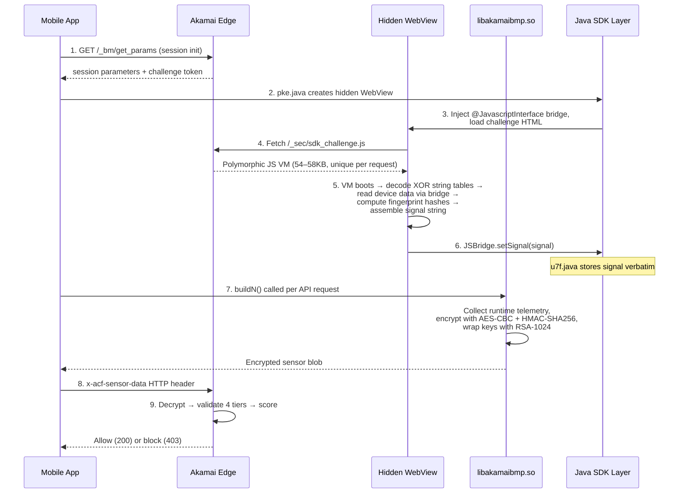

<div align="center">

# Akamai Bot Manager Premier — Mobile SDK Technical Analysis

**How Akamai's mobile anti-bot SDK fingerprints devices, validates authenticity, and scores requests**

*Reverse engineering analysis of BMP v4.0.4 from a production Android application*

---

[Architecture](#architecture) · [Fingerprinting](#device-fingerprinting-purejs-signal) · [Sensor Format](#sensor-format) · [Validation Model](#server-side-validation) · [The VM](#the-challenge-javascript-vm) · [Methodology](#methodology)

</div>

---

## Overview

Akamai Bot Manager Premier (BMP) is a mobile SDK embedded in Android and iOS apps. Where web-based Akamai protection runs JavaScript in a browser tab and produces `_abck` cookies, BMP works inside the app itself: it injects a hidden WebView, runs a polymorphic JavaScript VM, collects hardware fingerprints, encrypts everything with RSA/AES, and attaches the result as an HTTP header on every API request.

This is a reverse engineering analysis of BMP v4.0.4 from the Argos Android app (v5.26.0). The work combined static analysis of 54 to 58KB of obfuscated JavaScript, Frida instrumentation on a physical Pixel 4a, Ghidra analysis of the native encryption library (`libakamaibmp.so`), and decompilation of 20,991 Java classes.

What came out of it:

- The SDK computes three browser-engine fingerprints through deliberately misnamed algorithms. None of them hash what the names suggest.
- The sensor carries 30 fields: device identity, behavioural telemetry, PRNG verification, and cryptographic attestation.
- Server-side validation runs in four tiers, from TLS fingerprinting at the network level through mathematical PRNG proofs to behavioural scoring.
- The polymorphic JS VM has a self-integrity system. Changing a single byte of its source silently corrupts all internal state.

Each reversed algorithm was validated by reproducing its output from known inputs and comparing against captured production sensors byte-for-byte.

---

## Architecture

BMP v4.0.4 has five components forming a pipeline from data collection to encrypted sensor submission:



### Components

| Component | Implementation | Responsibility |
|:----------|:---------------|:---------------|
| **WebView Controller** | `pke.java` | Creates a hidden (zero-size) WebView at runtime, constructs the challenge URL with embedded device parameters, injects the JavaScript bridge |
| **JavaScript Bridge** | `u7f.java` | Exposes 18 device getter methods to the WebView JS via `@JavascriptInterface`. Stores the completed signal verbatim — performs no modification or assembly |
| **Challenge JS VM** | `sdk_challenge.js` | Server-generated polymorphic webpack module containing a switch-dispatch bytecode interpreter with ~150 case handlers. Computes all fingerprint values |
| **Native Library** | `libakamaibmp.so` | CyberFend encryption engine. Exports 5 JNI methods. Handles AES-128-CBC encryption, HMAC-SHA256 integrity, and RSA-1024 key wrapping. Does not compute fingerprints |
| **SDK Orchestrator** | `b.java` | OkHttp interceptor. Assembles the final header by combining the encrypted sensor, timing data, and device attestation blob separated by `$$$` |
| **String Deobfuscation** | `CircleProgressBar.java` | Innocuously named utility class whose `a(String)` method decodes obfuscated constants throughout the Java layer — e.g., `a("SV]}DMKN")` → `"JSBridge"` |

---

## Device Fingerprinting (`pureJsSignal`)

The `pureJsSignal` field, embedded in the challenge signal, contains three computed values that form a stable hardware fingerprint. Akamai deliberately misnames the fields to waste reverse engineers' time:

| Akamai's Name | What It Suggests | What It Actually Computes |
|:--------------|:-----------------|:--------------------------|
| `ua_hash` | Hash of User-Agent string | SHA-256 of 38 CSS system colour values resolved via `getComputedStyle` |
| `pkgHashCode` | Hash of app package name | Java `String.hashCode` of an HTML canvas `toDataURL()` rendering |
| `uaHashCode` | Hash of User-Agent string | Java `String.hashCode` of a second, different canvas rendering |

I worked this out by overriding one browser API at a time and diffing the output:

| Override Applied | `locale` | `ua_hash` | `pkgHashCode` | `uaHashCode` |
|:-----------------|:---------|:----------|:--------------|:-------------|
| None (baseline) | `en-US` | `e79ca373...` | `533473543` | `1556626983` |
| `navigator.userAgent` changed | `en-US` | same | same | same |
| `navigator.language` → `fr-FR` | **`fr-FR`** | same | same | same |
| `appIdentifier` changed | `en-US` | same | same | same |
| `canvas.toDataURL` returns constant | `en-US` | same | **`-1793983051`** | **`-1793983051`** |
| CSS `getComputedStyle` + WebGL params | `en-US` | **`b27504...`** | same | same |
| WebGL `getParameter` alone | `en-US` | same | same | same |

The canvas override test was what cracked it: both `pkgHashCode` and `uaHashCode` collapsed to the same value (-1793983051), which meant they use the same hash function and only differ in the canvas input.

### Algorithm 1: CSS System Colour Fingerprint (`ua_hash`)

The challenge JS creates a hidden `<div>` and walks 38 CSS system colour names (legacy CSS2 keywords that different browser engines resolve differently). For each one it sets `background-color`, reads `getComputedStyle().backgroundColor`, serialises the full mapping as compact JSON, and SHA-256 hashes it.

<details>
<summary>The 38 CSS system colours probed (with Android 13 / Chrome 149 values)</summary>

&nbsp;

| # | Colour Name | Resolved Value |
|:--|:------------|:---------------|
| 1 | `ActiveBorder` | `rgb(118, 118, 118)` |
| 2 | `ActiveCaption` | `rgb(255, 255, 255)` |
| 3 | `ActiveText` | `rgb(255, 0, 0)` |
| 4 | `AppWorkspace` | `rgb(255, 255, 255)` |
| 5 | `Background` | `rgb(255, 255, 255)` |
| 6 | `ButtonBorder` | `rgb(118, 118, 118)` |
| 7 | `ButtonFace` | `rgb(239, 239, 239)` |
| 8 | `ButtonHighlight` | `rgb(239, 239, 239)` |
| 9 | `ButtonShadow` | `rgb(239, 239, 239)` |
| 10 | `ButtonText` | `rgb(0, 0, 0)` |
| 11 | `Canvas` | `rgb(255, 255, 255)` |
| 12 | `CanvasText` | `rgb(0, 0, 0)` |
| 13 | `CaptionText` | `rgb(0, 0, 0)` |
| 14 | `Field` | `rgb(255, 255, 255)` |
| 15 | `FieldText` | `rgb(0, 0, 0)` |
| 16 | `GrayText` | `rgb(128, 128, 128)` |
| 17 | `Highlight` | `rgba(51, 181, 229, 0.4)` |
| 18 | `HighlightText` | `rgb(0, 0, 0)` |
| 19 | `InactiveBorder` | `rgb(118, 118, 118)` |
| 20 | `InactiveCaption` | `rgb(255, 255, 255)` |
| 21 | `InactiveCaptionText` | `rgb(128, 128, 128)` |
| 22 | `InfoBackground` | `rgb(255, 255, 255)` |
| 23 | `InfoText` | `rgb(0, 0, 0)` |
| 24 | `LinkText` | `rgb(0, 0, 238)` |
| 25 | `Mark` | `rgb(255, 255, 0)` |
| 26 | `MarkText` | `rgb(0, 0, 0)` |
| 27 | `Menu` | `rgb(255, 255, 255)` |
| 28 | `MenuText` | `rgb(0, 0, 0)` |
| 29 | `Scrollbar` | `rgb(255, 255, 255)` |
| 30 | `ThreeDDarkShadow` | `rgb(118, 118, 118)` |
| 31 | `ThreeDFace` | `rgb(239, 239, 239)` |
| 32 | `ThreeDHighlight` | `rgb(118, 118, 118)` |
| 33 | `ThreeDLightShadow` | `rgb(118, 118, 118)` |
| 34 | `ThreeDShadow` | `rgb(118, 118, 118)` |
| 35 | `VisitedText` | `rgb(85, 26, 139)` |
| 36 | `Window` | `rgb(255, 255, 255)` |
| 37 | `WindowFrame` | `rgb(118, 118, 118)` |
| 38 | `WindowText` | `rgb(0, 0, 0)` |

Note that `Highlight` (row 17) returns `rgba()` with an alpha channel — unique to Android Chrome's rendering path and a strong differentiator from desktop browsers.

</details>

The serialisation and hashing:

```python
import hashlib, json

def css_color_hash(color_map: dict, color_names: list) -> str:
    ordered = {name: color_map[name] for name in color_names}
    serialized = json.dumps(ordered, separators=(",", ":"))
    return hashlib.sha256(serialized.encode("utf-8")).hexdigest()

# Verification: matches Frida capture from Pixel 4a exactly
# "920a650b922995f6c26c190a3e10da6aee3557b9f7753de59d05b820311f5af5"
```

Different Chrome versions, Android versions, and platforms resolve these legacy colour names to different RGB values, so the hash acts as a per-platform identifier without needing an explicit device ID.

### Algorithms 2 & 3: Canvas Rendering Fingerprint (`pkgHashCode` / `uaHashCode`)

Both values come from the same process: draw an image on a canvas, call `toDataURL()` to get the rendered pixels as a base64 PNG, and hash the whole data URL with Java's `String.hashCode` (`h = 31*h + c`, signed 32-bit).

The canvas drawing specification (captured via Frida canvas API hooks):

| Step | Operation | Value |
|:-----|:----------|:------|
| 1 | Canvas size | 280 × 60 |
| 2 | `fillStyle` | `rgb(102, 204, 0)` — green |
| 3 | `fillRect(100, 5, 80, 50)` | Green rectangle |
| 4 | `fillStyle` | `#f60` — orange |
| 5 | `font` | `16pt Arial` |
| 6 | `fillText(text, 10, 40)` | **Differs per canvas** |
| 7 | `strokeStyle` | `rgb(120, 186, 176)` — teal |
| 8 | `arc(80, 10, 20, 0, π, false)` | Upper semicircle |
| 9 | `stroke()` | Draw the arc |

Two canvases are rendered with identical operations except the `fillText` string. The text strings change with each new challenge JS build Akamai serves; the drawing pipeline, colours, dimensions, and arc parameters stay fixed.

I identified the hash function by testing the calibration value from the canvas override test against every common 32-bit hash:

```python
def java_string_hashcode(s: str) -> int:
    """Java String.hashCode: h = 31*h + c, signed 32-bit."""
    h = 0
    for c in s:
        h = ((h * 31) + ord(c)) & 0xFFFFFFFF
    return h - 0x100000000 if h >= 0x80000000 else h

# Calibration: java_string_hashcode("data:image/png;base64,FAKE_CONSTANT_CANVAS_FINGERPRINT")
#   == -1793983051  (exact match to override test where both hashes collapsed)
```

`toDataURL()` is deterministic for a given GPU, driver, and Chrome version, but differs across devices. The same drawing commands produce subtly different pixels on an Adreno 618 (Pixel 4a) vs a Mali-G78 (Samsung S21) vs Intel UHD (desktop). You can't spoof this by overriding JavaScript properties alone.

### Why the Names Are Misleading

This looks deliberate. If you take `ua_hash` at face value you'll spend hours trying to match a hash of `navigator.userAgent` and get nowhere, because it doesn't hash the user agent. `pkgHashCode` leads you to the app package name, also a dead end. It cost me several analysis phases before differential testing showed the real inputs.

---

## Sensor Format

The `x-acf-sensor-data` HTTP header carries the encrypted sensor. Format:

```
6,a,{RSA(AES_key)},{RSA(HMAC_key)}${b64(IV||ciphertext||HMAC)}${T1},{T2},{T3}$$${attestation}
```

| Segment | Contents |
|:--------|:---------|
| Header | Protocol version (`6`), sub-version (`a`), Base64 RSA-PKCS1v15 encrypted AES-128 key, Base64 RSA-PKCS1v15 encrypted HMAC-SHA256 key |
| Payload | Base64 of `IV (16 bytes) \|\| AES-128-CBC(PKCS7(plaintext)) \|\| HMAC-SHA256(IV \|\| ciphertext)` |
| Timing | Three integers: total encryption time (80–300ms), RSA time (25–45ms), AES time (27–50ms) |
| Attestation | URL-encoded Play Integrity / SafetyNet blob. Cryptographically bound to the device by Google's servers. Cannot be generated synthetically. |

### Encryption

Keys are generated once per session and reused across all sensors:

- **RSA-1024-PKCS1v15** wraps a 16-byte AES key and a 32-byte HMAC key separately, using a public key embedded in the native SDK
- **AES-128-CBC** encrypts the sensor plaintext with PKCS7 padding and a fresh random 16-byte IV per sensor
- **HMAC-SHA256** provides integrity over `IV || ciphertext`, producing a 32-byte authentication tag

### Plaintext Fields

The decrypted payload contains 30 fields delimited by `-1,2,-94,`:

<details>
<summary><b>Complete 30-field breakdown</b></summary>

&nbsp;

| Pos | Field | Contents | Stability |
|:----|:------|:---------|:----------|
| 0 | SDK Version | `4.0.4` | Static |
| 1 | -90 | Challenge JS signal: pureJsSignal + serverSideSignal + device metadata | Session |
| 2–4 | -70, -80, -121 | Reserved (empty) | Immutable |
| 5 | -100 | Device fingerprint: model, build, screen, Android ID, build fingerprint, CRC triplet | Per-call |
| 6 | -101 | Sensor capability flags: orientation, motion, touch status | Device |
| 7 | -102 | SDK state code | Device |
| 8 | -103 | Activity lifecycle events (onPause/onResume timestamps) | Per-call |
| 9 | -104 | CPU architecture data: SDK constant (`-2,3,-50,-301`) + ARMv8/v7 level from `/proc/cpuinfo` | Device |
| 10 | -108 | Text input events | Immutable |
| 11 | -112 | Performance metrics (9 values, SDK init timing) | Session |
| 12 | -115 | Rolling counters: GF(2) CLMUL counter, current timestamp, 17 values | Per-call |
| 13–20 | -117 to -143 | Behavioural telemetry: touch trail, orientation, motion (8 fields) | Immutable* |
| 21 | -150 | Capture control flags | Per-call |
| 22 | -163 | App identity: signing certificate SHA-1, version, init timestamps | Session |
| 23 | -165 | OS info: Android version, locale, local IP | Device |
| 24 | -166 | Android build info: 20 probe slots, build ID, baseband, ABIs, security patch, app fingerprint hash (SHA-256 of installed non-system apps), full UA | Device |
| 25 | -171 | API endpoint URL | Device |
| 26 | -240 | Control flag | Immutable |
| 27 | -172 | MT19937 PRNG verification (simple): 4 values via `extract() % 4096` | Per-call |
| 28 | -164 | Security patch date (added by native `buildN`, not from Java layer) | Device |
| 29 | -170 | MT19937 PRNG verification (cascade): multipliers 7,8,9,5 with XOR chain | Per-call |

*\* Empty in captures because orientation/motion sensors were not granted permissions. In a real user session these fields contain timestamped sensor readings.*

Fields 0–27 are provided by the Java layer as 28 key-value pairs. Fields 28–29 are appended by the native `buildN()` function — confirmed via Ghidra analysis showing `buildN` reading `Build.VERSION.SECURITY_PATCH` at address `0x0019d85c`.

</details>

### Data Collection Categories

The 30 fields fall into four stability categories, which tells you how Akamai uses them:

| Category | Example Fields | What Akamai Checks |
|:---------|:---------------|:-------------------|
| **Immutable** | Empty reserved fields, behavioural placeholders | Structural consistency — these must always be empty |
| **Device-stable** | Model, build fingerprint, screen dimensions, CPU arch, capability flags | Cross-validation against known device databases |
| **Session-stable** | Challenge signal, performance metrics, app identity, crypto keys | Session binding — these must not change within a session |
| **Per-call dynamic** | CRC triplet, MT19937 values, timestamps, counters | Mathematical verification and temporal plausibility |

---

## Server-Side Validation

From 60+ sensor submissions with varying configurations, `server-timing` header analysis, and structural analysis, I mapped Akamai's validation to four tiers. Each is progressively more expensive and only runs if the previous one passes:

| Tier | Stage | Checks | Cost |
|:-----|:------|:-------|:-----|
| **0** | **Network** | IP reputation · TLS fingerprint (JA3/JA4 vs claimed UA) · TCP/IP passive OS fingerprint (p0f) · HTTP/2 SETTINGS frame | Pre-decryption. Rejects before touching the sensor. |
| **1** | **Structural** | RSA key recovery · HMAC-SHA256 integrity · AES block alignment · Field count and delimiter pattern | Proves the client used Akamai's public key and the payload is intact. |
| **2** | **Field-Level** | CRC triplet consistency · pureJsSignal hash verification · serverSideSignal session binding · MT19937 mathematical proof · Timestamp coherence | Cross-validates sensor contents against expected values. |
| **3** | **Behavioural** | Sensor cadence · Counter monotonic progression · Cookie chain (bm_sz → ak_bmsc) · Device attestation signature · IP trust budget | Session-level analysis. The most expensive and hardest to spoof. |

Each tier feeds a composite bot score (visible in the `server-timing` header). Low single digits pass; above 10 triggers blocking on sensitive endpoints.

One thing worth noting: IP trust budget carries across requests. Valid sensors from a real device build up trust on that IP. I confirmed this when exactly one of 60 synthetic attempts passed, right after 20+ real-device submissions from the same IP.

---

## The Challenge JavaScript VM

The `sdk_challenge.js` served from `/_sec/sdk_challenge.js` is a well-built piece of JS obfuscation:

| Property | Detail |
|:---------|:-------|
| **Architecture** | Switch-dispatch bytecode interpreter with ~150 case handlers across two interpreter functions (`Hn`/`pn` for crypto operations, `En`/`Wk` for threaded setup) |
| **String obfuscation** | 4 XOR-encoded pools: `rn` (48), `GX` (41), `PX` (53), `bX` (49) — 191 total entries, decoded at runtime via rolling-key XOR |
| **Self-integrity** | `X = embedded_constant - MurmurHash3(source.toString(), seed)`. `X` is used as the key offset for every string decode. Modifying a single byte shifts `X`, corrupting all decoded strings. The VM fails **silently** — no errors, no output |
| **Polymorphism** | Every request to `/_sec/sdk_challenge.js` returns a textually unique build: different IIFE name, variable names, integrity seed, canvas fillText strings, XOR key material. The algorithms and structure stay the same. |
| **Numeric encoding** | JSFuck-style digit construction: `vP = +[]` (0), `TP = +!+[]` (1), etc. Case labels composed positionally in base 10 |
| **Key cases** | `P5` (131) = pureJsSignal assembly, `J5` (55) = SHA-256, `F5` (345) = hex encoder, `Q5` (72) = JSBridge accessor setup, `I5` (52) = signal finaliser |

The self-integrity system is worth examining closely. MurmurHash3 runs over the function's own `toString()` output plus `typeof window[iifeName]`. So the hash changes if the source is modified, the code is reformatted, or the global scope changes in a way that affects the `typeof` result. All 191 string table entries decode via key indices that incorporate `X`, so a wrong `X` produces garbage strings throughout. The VM doesn't crash. It just operates on nonsense and produces no output.

<details>
<summary><b>Decoded VM string table (129 of 191 entries mapped)</b></summary>

&nbsp;

The full decoded string mapping is available in [`data/O-method-mapping.json`](data/O-method-mapping.json) (236 of 241 `O` object members resolved). Key entries:

| O Member | Decoded String | Purpose |
|:---------|:---------------|:--------|
| `O.mP` | `"window"` | Global scope access |
| `O.rF` | `"JSBridge"` | Android bridge object |
| `O.XP` | `"webkit"` | iOS bridge path |
| `O.EN` | `"messageHandlers"` | iOS bridge path |
| `O.UN` | `"setSignal"` | Signal submission method |
| `O.gN` | `"postMessage"` | iOS data posting |
| `O.EP` | `"setRes"` | Data callback registration |
| `O.NF` | `"concat"` | String assembly |
| `O.cN` | `"length"` | Array/string length |
| `O.QP` | `"toString"` | String conversion |
| `O.DP` | `"android"` | Platform detection |
| `O.GP` | `"="` | Key-value separator |

</details>

---

## Methodology

### Analysis Scope

| Metric | Value |
|:-------|:------|
| Analysis duration | ~12 hours continuous |
| Frida scripts written | ~47 |
| `buildN` captures analysed | 189 across 6 sessions |
| Java files decompiled | 20,991 (full APK) |
| Hash algorithms tested | CRC32, DJB2, FNV-1a, MurmurHash3 (seeds 0–2M), Adler32, Java String.hashCode |
| Tools | Frida, Ghidra, Node.js, androguard, JADX |

### Approach

The analysis was iterative: form a hypothesis, test it, pivot when it's wrong. Seven wrong turns, each one narrowing the search space:

| # | Wrong Assumption | What It Revealed |
|:--|:-----------------|:-----------------|
| 1 | Node.js can run the challenge JS | The self-integrity check requires a real browser environment — `Intl.DateTimeFormat` must exist |
| 2 | The 54KB JS file from the APK is complete | The server delivers 58KB with 21 additional functions implementing the fingerprint pipeline |
| 3 | `pureJsSignal` is computed by the native library | Ghidra found zero fingerprint-related strings or MurmurHash constants in `libakamaibmp.so` — it handles encryption only |
| 4 | The hash function is MurmurHash3 | Two million seed values tested, zero matches. The function is Java `String.hashCode` — `*31` is spread across VM opcodes, invisible to static grep |
| 5 | `ua_hash` hashes the User-Agent | Changing `navigator.userAgent` has zero effect. CSS `getComputedStyle` override changes it immediately |
| 6 | `pkgHashCode` hashes the package name | Changing `appIdentifier` has zero effect. Canvas `toDataURL` override changes both hash codes |
| 7 | The two canvas hashes use different functions | Faking `toDataURL` to a constant makes both collapse to the same value — same function, different inputs |

Differential testing (override one browser API per test, diff the output) is what resolved the fingerprint algorithms. Static analysis of the VM bytecode can tell you *that* hashing occurs but not *what* is hashed, because input data flows through decoded string table lookups gated behind the integrity value `X`.

### Validation

Each reversed algorithm was validated by reproducing its output from known inputs and comparing against captured production data. Fingerprint hashes, encryption envelopes, and field formats all matched byte-for-byte, confirming the analysis was correct. Akamai's four-tier validation would catch any structural or mathematical inconsistency, so matching the captured output is strong evidence of a complete understanding.

---

## Target Application

| | |
|:--|:--|
| **Application** | Argos Android v5.26.0 (`com.homeretailgroup.argos.android`) |
| **SDK Version** | Akamai Bot Manager Premier v4.0.4 |
| **Baseline Device** | Google Pixel 4a (sunfish), Android 13, Chrome/149 WebView |
| **Native Library** | `libakamaibmp.so` — CyberFend, ARM64, 1.9MB decrypted |

---

## Repository Structure

```
├── docs/                          # Extended analysis (24 pages across 4 parts)
│   ├── part1-understanding/       # System architecture, data flow, sensor format, VM internals,
│   │                              #   fingerprint algorithms, server validation model
│   ├── part2-methodology/         # 11-phase RE journey with every dead end documented
│   └── part3-reference/           # Field-by-field reference, encryption spec, algorithm
│                                  #   implementations, cookie/TLS policy
├── frida/                         # Frida instrumentation scripts used during analysis
└── data/                          # Decoded VM string tables and method mappings
    ├── O-method-mapping.json      # 236/241 resolved O object members with decode provenance
    └── decoded-names-ordered.json # 129 unique decoded strings in pool traversal order
```

This repository contains **research documentation only**. No runnable exploit code, sensor generators, or bypass tooling is included.

---

## Disclaimer

This is published for educational and security research purposes. It documents how a specific anti-bot system works to improve understanding of mobile SDK security, device fingerprinting, and JavaScript VM obfuscation. Use responsibly and within applicable laws and terms of service.

## Licence

[MIT](LICENSE)
