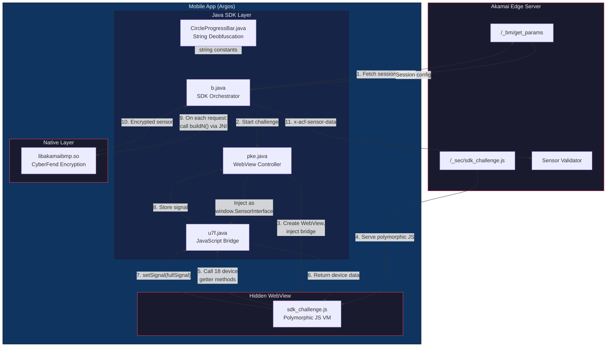

# System Overview & Architecture

## What Akamai BMP Is

Akamai Bot Manager Premier (BMP) is a server-side bot detection system that uses a native mobile SDK embedded inside Android and iOS applications. It is fundamentally different from the web-based Akamai protection that most reverse engineers encounter first. The web variant runs JavaScript in a browser tab, collects browser fingerprints, and stores its output in the `_abck` cookie. BMP operates in an entirely separate domain: it lives inside compiled mobile applications, collects device telemetry through a combination of Java, JavaScript, and native code, encrypts the result with a hybrid RSA/AES scheme, and attaches it as the `x-acf-sensor-data` HTTP header on every API request the app makes.

The server inspects this header to decide whether the request originates from a genuine app instance running on a real device or from a synthetic client. Requests that fail validation receive a 400 or 403 response; requests that pass proceed to the origin API.

BMP version 4.0.4 --- the version documented throughout this guide, as deployed in the Argos Android app (package `com.homeretailgroup.argos.android` v5.26.0) --- ships as a native shared library (`libakamaibmp.so`, internally branded "CyberFend") alongside a Java/Kotlin SDK layer under the `com.cyberfend.cyfsecurity` namespace. Protection operates at two distinct layers: a **JavaScript challenge** that runs inside a hidden WebView to fingerprint the browser and device environment, and a **native encryption pipeline** that packages all collected telemetry into an encrypted sensor blob. These two layers produce different outputs that are combined into the final header value.

The practical consequence for anyone attempting to replicate the sensor is that you must understand and reimplement both layers --- the JS challenge logic and the native encryption --- plus the orchestration glue that ties them together.

---

## The Five Components

The BMP SDK comprises five interacting components. Each sits at a different layer of the Android stack, and each serves a distinct role in the sensor generation pipeline.

---

## Role of Each Component

### pke.java --- WebView Controller

`pke` is the class responsible for creating and managing the hidden WebView that executes Akamai's JavaScript challenge. It performs four tasks:

1. **Creates a hidden `WebView`** --- not attached to any visible layout, so the user never sees it.
2. **Constructs the challenge URL** by appending device parameters as query string arguments: `starttime`, `systemVersion`, `model`, `deviceHardwareType`, `appIdentifier`, `deviceId`, and `serverSideSignal`. These parameters tell the server-side challenge generator which device profile to expect in the response signal.
3. **Injects the JavaScript bridge** --- it instantiates a `u7f` object and registers it as `window.SensorInterface` on the WebView, making 18 device getter methods and two setter methods callable from JavaScript.
4. **Reads back the completed signal** via `pke.c()`, which returns the value stored in `u7f.b` after the challenge JS has finished executing and called `setSignal()`.

The WebView loads an HTML page that pulls the challenge script from `/_sec/sdk_challenge.js`. Once the challenge completes and the signal is stored, the WebView's job is done. It persists in memory for session reuse but plays no further role in individual sensor generation.

### u7f.java --- JavaScript Bridge (@JavascriptInterface)

`u7f` is the `@JavascriptInterface`-annotated class that serves as the communication bridge between the challenge JavaScript running in the WebView and the Java SDK layer. It exposes **18 device getter methods** that the JS can call to read device properties:

| Method | Returns |
|--------|---------|
| `model()` | `Build.MODEL` (e.g. `"Pixel 4a"`) |
| `systemVersion()` | `Build.VERSION.RELEASE` (e.g. `"13"`) |
| `androidId()` | `Settings.Secure.ANDROID_ID` |
| `hardWareType()` | Device hardware type string |
| `screenHeight()` | Display height in pixels |
| `screenWidth()` | Display width in pixels |
| `adbStatus()` | Whether ADB debugging is enabled |
| `buildId()` | `Build.ID` |
| `appIdentifier()` | Application package name |
| `startTime()` | SDK initialisation timestamp |
| `sdkVersion()` | BMP SDK version string |
| `host()` | Target API hostname |
| `carrierName()` | Mobile carrier name |
| `cpuABI()` | `Build.SUPPORTED_ABIS[0]` |
| `isDebugEnabled()` | Whether the app is debuggable |
| `deviceProperties()` | Concatenated device property string |
| `mountFileProperties()` | Mount point enumeration (root detection) |
| `qemuProperties()` | Emulator detection properties |
| `defaultBuildFingerPrintProperties()` | Build fingerprint string |
| `getServerSignals()` | Comma-separated device fields: `{startTime},{sdkVersion},{androidId},{buildId},{systemVersion},{model},{host}` |

It also exposes two setter methods:

- **`setSignal(String)`** --- called by the challenge JS to deliver the computed signal. The implementation is trivial: `this.b = str; done();`. It stores the signal verbatim and signals completion.
- **`setOrder(String)`** --- receives a field ordering string that controls how signal fields are arranged.

### sdk_challenge.js --- Polymorphic JavaScript VM

The challenge JavaScript is the most complex single component in the system. Akamai's server generates it fresh for every request, producing a **polymorphic, webpack-bundled JavaScript file** of approximately 54--58KB. Each serve has different variable names, a different IIFE wrapper name, a different integrity marker, and a different MurmurHash3 seed --- but the underlying algorithms are identical across all serves.

At its core, the script contains a **switch-dispatch bytecode interpreter**. Rather than executing fingerprinting logic directly, the code encodes its operations as bytecode instructions that a dispatcher loop evaluates case-by-case. The VM implements:

- **Self-integrity checking** --- computes MurmurHash3 over its own `toString()` output to detect tampering. The expected hash is embedded in the bytecode as an XOR-obfuscated constant, and the seed changes with every serve.
- **XOR-decoded string tables** --- four pools containing 191 entries total. String literals (property names, API calls, constants) are stored as XOR-encoded arrays and decoded at runtime.
- **SHA-256 hashing** (case `J5` in the dispatch table) --- used to compute the `ua_hash` component of the `pureJsSignal`.
- **Hex encoding** (case `F5`) --- converts binary hash output to hexadecimal strings.
- **Java `String.hashCode`** --- computes `pkgHashCode` and `uaHashCode` as signed 32-bit hashes (`h = 31*h + c`) of two canvas `toDataURL()` outputs. Despite their names, these do not hash the package name or user agent string. MurmurHash3 is used only for the self-integrity check (seed 88692), never for fingerprint hashes.
- **Signal assembly** (case `P5`) --- concatenates all collected fields into the final signal string and calls `SensorInterface.setSignal()`.
- **Platform dispatch** --- detects whether it is running on iOS or Android and adjusts its bridge API calls accordingly.

The polymorphism is purely cosmetic: variable renaming, wrapper shuffling, and seed rotation. The instruction set, handler implementations, and signal format remain stable across serves. This is what makes static reimplementation feasible.

### libakamaibmp.so --- Native Encryption Library (CyberFend)

`libakamaibmp.so` is a stripped, partially self-encrypted ARM64 shared library that handles all cryptographic operations. It exposes exactly **five JNI methods**: `initializeKeyN`, `encryptKeyN`, `decryptN`, `buildN`, and test stubs.

Its responsibilities are:

- **Sensor plaintext assembly** --- `buildN()` collects runtime telemetry (touch events, timing data, accelerometer readings, lifecycle events, PRNG verification values from a Mersenne Twister), merges them with the JS signal string, and serialises everything into a structured plaintext using the `-1,2,-94,` field delimiter format.
- **AES-CBC encryption** --- generates a random 16-byte IV per sensor, encrypts the plaintext with AES-128-CBC using a randomly generated session key.
- **HMAC-SHA256 integrity** --- computes an HMAC over the ciphertext to provide tamper detection.
- **RSA-1024 key wrapping** --- the AES and HMAC session keys are encrypted with Akamai's RSA-1024 public key, so only Akamai's server (which holds the private key) can recover them.
- **SHA-256** --- the library contains its own SHA-256 implementation (K-table at offset `0x2925c0` in the decrypted image) used for sensor payload integrity computation.

Critically, `libakamaibmp.so` does **not** compute any of the `pureJsSignal` values --- those are produced exclusively by the challenge JavaScript. The native library consumes the JS signal as an opaque string.

### b.java --- SDK Orchestrator

`b.java` (in the `com.cyberfend.cyfsecurity` namespace) is the top-level orchestrator that ties everything together. It manages:

- **The `pke` lifecycle** --- initialising the WebView challenge, waiting for the signal, and caching it for the session.
- **The OkHttp interceptor** --- hooking into the app's HTTP client so that every outbound API request automatically has a sensor header attached.
- **Final header assembly** --- on each request, it calls `buildN()` via JNI to get the encrypted sensor blob, then assembles the complete `x-acf-sensor-data` header value by concatenating: `{buildN output}${PoW response}${CCA token}${server token from pke.f}`. The segments are separated by `$` delimiters.

The server token (`pke.f`) is a 254-byte session attestation blob obtained during the initialisation handshake with Akamai's edge. It is distinct from the JS-generated signal and cannot be independently generated --- it must be captured from a real device session.

### CircleProgressBar.java --- String Deobfuscation

An innocuously named class whose sole purpose is string deobfuscation. Its `a(String)` method decodes obfuscated string constants used throughout the Java SDK layer. For example, `a("SV]}DMKN")` decodes to `"JSBridge"`. The class name is deliberately misleading --- it has nothing to do with progress bars or UI. It is a classic example of hiding functionality behind a benign class name to deter casual inspection.

---

## Component Responsibility Table

| Component | Layer | Primary Responsibility | Input | Output |
|-----------|-------|----------------------|-------|--------|
| `pke.java` | Java | WebView lifecycle, challenge URL construction | Device params, server config | Completed JS signal string |
| `u7f.java` | Java | JavaScript-to-Java bridge (18 getters + 2 setters) | JS method calls | Device property values; stored signal |
| `sdk_challenge.js` | JavaScript (WebView) | Device fingerprinting, hash computation, signal assembly | Device data via bridge, server seed | Signal string via `setSignal()` |
| `libakamaibmp.so` | Native (ARM64) | Sensor encryption (AES-CBC + RSA key wrapping + HMAC) | JS signal + runtime telemetry | Encrypted sensor blob |
| `b.java` | Java | SDK orchestration, OkHttp interception, header assembly | Encrypted sensor + tokens | `x-acf-sensor-data` header |
| `CircleProgressBar.java` | Java | String constant deobfuscation | Obfuscated string | Decoded string |

---

## How the Generator Replaces the Real Pipeline

The standalone generator (`tools/bmp-generator.py`) eliminates the dependency on a real Android device and WebView by reimplementing every stage of the pipeline in Python. The replacement maps directly onto the five stages of the real SDK:

1. **Device profile** --- instead of reading `Build.MODEL`, `Build.VERSION.RELEASE`, and other system properties from a real device, the generator holds a `DeviceProfile` object with hardcoded values matching a Pixel 4a running Android 13. This replaces the `u7f` bridge entirely.

2. **JS challenge signal** --- instead of executing the polymorphic challenge JS in a hidden WebView, the generator constructs the signal string directly from the device profile. The `pureJsSignal` hash values (`ua_hash`, `pkgHashCode`, `uaHashCode`) are pre-captured from a real device execution and stored in the profile. The signal is assembled in the canonical format: `startTime=X#cpuABI=Y#...#pureJsSignal=8,en-US,851,393,{ua_hash},,0,{pkgHashCode},{uaHashCode}#mapping_flag=1`.

3. **Sensor plaintext** --- the generator builds the same field-delimited plaintext that `buildN()` would produce, using the SDK version, JS signal, device fingerprint fields, PRNG verification values (MT19937), timing data, and CRC checksums. Fields are separated by the `-1,2,-94,` delimiter, matching the real SDK's wire format exactly.

4. **Encryption** --- the generator performs the same hybrid encryption scheme: generates random AES-128 and HMAC-SHA256 session keys, RSA-1024 encrypts them with Akamai's public key, AES-CBC encrypts the sensor plaintext with a random IV, computes HMAC-SHA256 over the ciphertext, and assembles the final header in the format `6,a,{RSA_AES},{RSA_HMAC}${b64(IV||ciphertext||hmac)}${T1},{T2},{T3}`.

5. **Server token** --- the 254-byte attestation suffix (`$$$` token from `pke.f`) must still be captured from a real device session via Frida, as it is issued by Akamai's server during the SDK initialisation handshake and cannot be independently generated. This is the one component the generator cannot synthesise.

The generator's output is structurally and cryptographically faithful to a real sensor. Of the six gaps originally identified, five have been resolved: (1) field -115's `counter_large` is now correctly computed using GF(2) polynomial multiplication (`CLMUL(c5, 0x6DB60000DB6D) mod (x^64 + x^33 + x^1)`), verified against 47 captured values; (2) the `-166` "ua_hash" is now synthetically generated as SHA-256 of installed app names (the original "Feistel cipher" and "native UA transformation" characterisations were both incorrect); (3) `sensor_hash` is confirmed as a compile-time constant from the Java SDK, captured once per SDK version; (4) `r_token` is confirmed as purely random with no device-bound inputs; (5) field -104, previously labelled "timezone data", is actually the CPU architecture level from `/proc/cpuinfo` plus an SDK constant. The remaining gaps are: pureJsSignal canvas hashes are hardcoded to a single Pixel 4a profile (though per-build `fillText` polymorphism limits server-side exact matching), the CPR signal field (-91) is absent, and the 20 leading `-1` placeholders in field -166 may contain device probe results in other app configurations. The primary detection surface lies in behavioural signals (sensor cadence, counter progression, IP trust budget) and the device attestation token, which are addressed in later sections.
