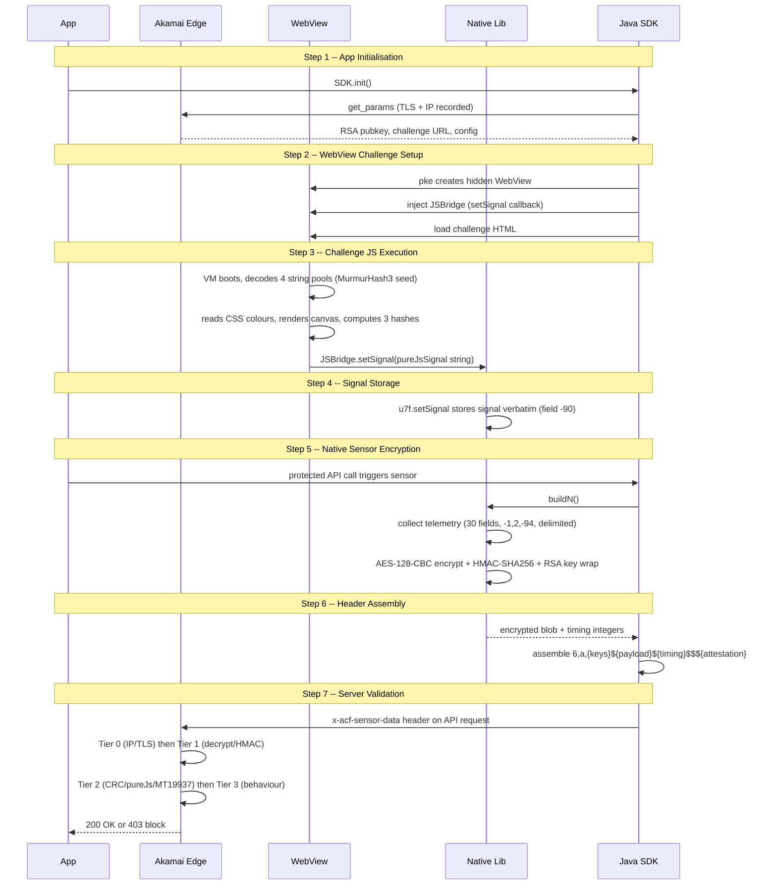

# The Sensor Generation Pipeline

Every request protected by Akamai BMP carries an `x-acf-sensor-data` header -- a single string that encodes device identity, behavioural telemetry, cryptographic proofs, and attestation evidence. Generating that header is not a single function call. It is a seven-step pipeline that spans the Akamai edge, the mobile SDK's Java layer, a hidden WebView running polymorphic JavaScript, a native C++ library (CyberFend), and the application itself.

This page traces a sensor from birth to validation, covering every participant and every data transformation along the way.

---

## The Seven Steps

### Step 1: App Initialisation

When the host application starts, it initialises the Akamai BMP SDK (v4.0.4 in the Argos Android case). The SDK immediately calls `get_params` against the Akamai edge, fetching a configuration bundle that contains the RSA-1024 public key, the challenge JavaScript URL, and server-side signal parameters. This bootstrap request uses the app's TLS profile (JA3 fingerprint) and the device's IP, both of which the edge records for Tier 0 scoring before a single sensor has been sent.

The SDK stores the configuration in memory, generates a session token (`r-{random_hex}`), and records the SDK initialisation timestamp. These values are session-stable: they persist across all subsequent sensor generations until the process is killed.

### Step 2: WebView Challenge Setup

With configuration in hand, the SDK's `pke` (Protection Key Engine) module creates a **hidden WebView**. This WebView is never rendered to the user -- it exists solely to execute Akamai's challenge JavaScript in a real browser environment. The SDK injects a `JSBridge` interface into the WebView, exposing a `setSignal` callback that the JavaScript can invoke to pass data back to native code. The challenge HTML is then loaded into the WebView.

The WebView inherits the device's real Chrome rendering engine (Chrome/149 on the Pixel 4a baseline), which means its canvas rendering, CSS colour resolution, and font metrics are genuine device artefacts rather than spoofed values.

### Step 3: Challenge JS Execution

The challenge JavaScript is a polymorphic, switch-dispatch bytecode interpreter with 130+ case handlers and four XOR-encoded string pools containing 191 entries. On every serve, Akamai's edge transpiler renames all identifiers while preserving the algorithms -- different names, same logic.

Upon execution, the VM boots by decoding its string tables using a self-integrity seed derived from a MurmurHash3 hash of its own `toString()` output. This gates all subsequent string decoding: if the script has been tampered with, the seed is wrong and the string pools decode to garbage.

Once booted, the VM reads device data through the WebView's DOM APIs, computes three fingerprint values, and calls `setSignal` on the JSBridge:

| Fingerprint | Akamai Field Name | Actual Algorithm |
|-------------|-------------------|------------------|
| CSS system colour hash | `ua_hash` | SHA-256 of 38 CSS `getComputedStyle` colour values |
| Canvas hash A | `pkgHashCode` | Java `String.hashCode` of `canvas.toDataURL()` output |
| Canvas hash B | `uaHashCode` | Java `String.hashCode` of a second canvas rendering |

Every field name is deliberately misleading. `ua_hash` has nothing to do with the user agent. `pkgHashCode` does not hash the package name. This is intentional misdirection aimed at reverse engineers who grep for field names and assume they describe their contents.

The signal string passed to `setSignal` is formatted as `pureJsSignal` with hash-delimited key-value pairs: `screenHeight={h}#screenWidth={w}#startTime={ts}#serverSideSignal={ss}#pureJsSignal={data}#mapping_flag=1`.

### Step 4: Signal Storage

On the native side, the JSBridge callback `u7f.setSignal` receives the JavaScript signal string **verbatim** and stores it in memory. No parsing, no transformation -- the raw string is held exactly as the WebView produced it. This string later becomes field `-90` in the sensor plaintext, the single largest field in the payload. Its integrity is verified server-side by re-executing the same fingerprint algorithms against the declared device properties.

### Step 5: Native Sensor Encryption

When a sensor is needed (triggered by the app making a protected API call), the native library's `buildN()` function takes over. It collects runtime telemetry -- timestamps, performance counters, lifecycle events, CPU architecture data, MT19937 PRNG verification proofs -- and serialises everything alongside the stored JavaScript signal into 30 fields delimited by `-1,2,-94,`.

The plaintext is then encrypted through a three-layer scheme:

1. **AES-128-CBC encryption.** A fresh 16-byte IV is generated per sensor. The AES-128 key itself is generated once per session (when the `CryptoContext` is created) and reused across all sensors in that session. The plaintext is PKCS7-padded and encrypted.
2. **HMAC-SHA256 integrity.** The 32-byte HMAC key is likewise generated once per session and reused. The MAC is computed over `IV || ciphertext` and appended to the blob.
3. **RSA-1024 PKCS1v15 key wrapping.** Both the AES key and HMAC key are independently encrypted under Akamai's RSA-1024 public key (hardcoded in the SDK binary at `libakamaibmp.so`). This wrapping happens once at session initialisation; the RSA-encrypted key blobs are reused in every sensor header for the session's lifetime.

The result is a binary blob: `IV (16B) || ciphertext (variable) || HMAC (32B)`, Base64-encoded for transport.

### Step 6: Header Assembly

The Java SDK assembles the final `x-acf-sensor-data` header by concatenating four segments separated by `$` delimiters:

```
6,a,{RSA_AES},{RSA_HMAC}${AES_CBC_PAYLOAD}${T1},{T2},{T3}$$${DEVICE_ATTESTATION}
```

The `$$$` before the attestation segment is not a typo. It is a **triple-dollar delimiter** that separates the cryptographic envelope from the device attestation blob. The attestation is URL-encoded and contains hardware-backed integrity evidence (SafetyNet/Play Integrity on Android).

Three timing integers (`T1`, `T2`, `T3`) are included as a lightweight anti-replay mechanism. They represent millisecond durations for key generation, encryption, and serialisation respectively, and the server validates that they fall within expected ranges for genuine SDK execution.

### Step 7: Server Validation

When the sensor arrives at Akamai's edge, validation proceeds through four tiers:

| Tier | Scope | Checks |
|------|-------|--------|
| 0 | Pre-decryption | IP reputation, TLS fingerprint (JA3), TCP/IP stack fingerprint |
| 1 | Structural | Envelope parse, RSA key recovery, HMAC integrity, AES-CBC block alignment, PKCS7 padding |
| 2 | Cross-validation | CRC field consistency, pureJsSignal hash verification, MT19937 PRNG sequence proofs |
| 3 | Behavioural | Sensor cadence analysis, counter monotonicity, timing distribution, attestation validity |

Failure at any tier produces a block or challenge response. The tiered design means cheap checks run first (IP lookups are nanoseconds; RSA decryption is microseconds) and expensive behavioural analysis only runs on sensors that pass structural validation.

---

## Sequence Diagram



---

## Envelope Format

The `x-acf-sensor-data` header value is a four-segment envelope. Each segment is separated by `$`, with the attestation separated by the special `$$$` triple delimiter.

| Segment | Format | Description |
|---------|--------|-------------|
| 1 | `6,a,{RSA_AES},{RSA_HMAC}` | Protocol version (`6`), sub-version (`a`), RSA-encrypted AES-128 key (Base64, 172 chars), RSA-encrypted HMAC-SHA256 key (Base64, 172 chars) |
| 2 | `{AES_CBC_PAYLOAD}` | Base64 encoding of `IV (16B) \|\| ciphertext (variable) \|\| HMAC-SHA256 (32B)`. The IV is random per sensor. Ciphertext is PKCS7-padded AES-128-CBC. The HMAC covers `IV \|\| ciphertext`. |
| 3 | `{T1},{T2},{T3}` | Three comma-separated timing integers (milliseconds). T1: key generation duration. T2: encryption duration. T3: serialisation duration. Validated server-side against expected SDK execution ranges. |
| 4 | `{DEVICE_ATTESTATION}` | URL-encoded device attestation blob (SafetyNet/Play Integrity), appended after the `$$$` triple-dollar delimiter. Contains hardware-backed integrity evidence. May be empty on emulators or rooted devices. |

A concrete example (truncated for readability):

```
6,a,Abc123...==,Xyz789...==$base64_IV_ciphertext_HMAC==$142,31,38$$$AAQAAAAF%2f%2f%2f...%3d
```

The version pair `6,a` has been stable across BMP v4.x releases. The `a` sub-version indicates the mobile SDK flavour (as distinct from the web sensor format, which uses a different version scheme entirely). If Akamai changes the envelope structure in a future release, the version numbers will increment and the server will dispatch to the appropriate parser.

---

## Key Design Observations

**Separation of concerns.** The JavaScript VM handles fingerprinting (what makes this device unique), the native library handles telemetry and encryption (what this device is doing and how to protect the payload), and the Java SDK handles transport (how to get the sensor to the edge). No single layer has the full picture, which means compromising one layer does not automatically compromise the others.

**Per-session key generation with per-sensor IVs.** The AES and HMAC keys are generated once per session (when the `CryptoContext` is initialised) and reused across all sensors in that session, wrapped under RSA. Only the AES-CBC initialisation vector is fresh per sensor. This means capturing one sensor's plaintext does not directly reveal the keys to an external observer (they are RSA-wrapped), but the same key material protects every sensor within a session. The only way to recover plaintext is to hold Akamai's RSA private key.

**The WebView is the anchor.** The pureJsSignal fingerprints are computed in a real browser engine, not in native code. This makes them extremely difficult to spoof because they depend on the actual rendering pipeline -- GPU, font rasteriser, CSS engine -- of the device's Chrome WebView. Emulators and modified browsers produce different canvas hashes, which fail Tier 2 cross-validation.

**Attestation as a backstop.** The device attestation blob in segment 4 is a hardware-backed claim that the device is genuine and unmodified. Even if every other field is perfectly spoofed, a missing or invalid attestation raises the risk score at Tier 3. On rooted devices or emulators, this field is typically empty, which Akamai treats as a strong negative signal.
