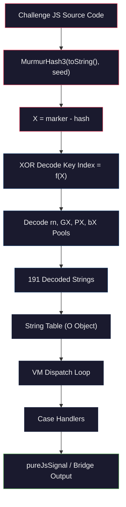

# The Polymorphic Challenge JavaScript VM

The challenge JavaScript served by `/_sec/sdk_challenge.js` is a self-protecting, polymorphic bytecode interpreter that runs inside a hidden Android WebView. Each request to this endpoint returns a textually unique build -- different variable names, different integrity markers, different XOR key material -- but every build implements the same algorithms against the same dispatch structure.

---

## Architecture: A Switch-Dispatch Bytecode Interpreter

The challenge JS is a single minified line, typically 54--58KB. It is wrapped in an IIFE whose name changes per serve (e.g. `dsXEzOjmVs` in one build, `dlIXcSWZBK` in the next). Inside the IIFE, three initialisation functions bootstrap the VM before any bytecode runs.

The interpreter uses **switch-dispatch**: a `while` loop reads the next opcode byte from a bytecode array, dispatches to the corresponding `case` handler, and each handler performs a single operation before returning control to the loop. The VM has over 130 case handlers spanning arithmetic, bitwise operations, comparisons, stack manipulation, control flow, object/property access, function creation, scope management, and exception handling.

The file is structured in distinct regions:

| Region | Approximate Size | Purpose |
|--------|-----------------|---------|
| IIFE wrapper + polyfill | ~400 bytes | `Array.prototype.entries` polyfill, outer IIFE |
| Three init functions | Variable | `Bg()` sets digit constants, `Sg()` computes case labels, `Q()` runs integrity check |
| Primary interpreter `Hn`/`pn` | ~15KB | Main switch-dispatch loop with 130+ case handlers, includes crypto primitives (SHA-256, Java String.hashCode, hex encoding) |
| Threaded setup interpreter `En`/`Wk` | ~8KB | Secondary interpreter that handles initialisation sequences, string pool population, and bridge wiring |
| String pool declarations | ~3KB | Four XOR-encoded arrays (`rn`, `GX`, `PX`, `bX`) plus one plaintext bootstrap table (`pk`) |
| Signal assembly logic | ~20KB | Canvas rendering, CSS colour probing, pureJsSignal construction, JSBridge communication |
| Tail / entry point | ~1KB | Final invocation that boots the VM |

`Hn`/`pn` (names vary per build) is the primary handler containing the full instruction set plus inline implementations of SHA-256, hex encoding, and the pureJsSignal builder. `En`/`Wk` is a secondary threaded interpreter handling setup: populating the decoded string table, wiring the JSBridge communication channel, and executing initialisation bytecode before handing control to the primary interpreter.

---

## The Self-Integrity System

The VM's most distinctive defence is a self-integrity interlock that makes source modification impossible without understanding the full decode chain:

1. The IIFE's outer function has a name (e.g. `dsXEzOjmVs`). The integrity check function `Q()` computes `MurmurHash3(functionBody.toString(), seed)` where the seed is a per-build constant (e.g. 88692). The `toString()` captures the source text as the browser sees it, including any whitespace normalisation.

2. The MurmurHash3 result is subtracted from an embedded hex marker constant (e.g. `38d466e`) to produce the value **X**. For one analysed build, `X = 805`.

3. X is the **modulus for every rolling-key XOR index** in the string decoding system. If X is wrong by even 1, every decoded string becomes garbage.

4. The VM does not crash or throw an error. It **fails silently**. Every property name becomes nonsense, every API call targets a non-existent method, and the signal never arrives at `JSBridge.setSignal()`.

Adding a `console.log`, injecting a `debugger` statement, or even pretty-printing the source changes the `toString()` output, shifts the MurmurHash3 result, changes X, and silently corrupts all 191 decoded strings. The only way to instrument the code is through external hooks (Frida, Proxy-based interception) that leave the source text unmodified.



---

## String Table Obfuscation

All meaningful strings in the challenge JS -- property names, API method names, error messages, bridge method names -- are stored in four XOR-encoded byte arrays and decoded at runtime using rolling keys seeded from X.

### The Four XOR Pools

| Pool Variable | Entry Count | Content Category |
|---------------|-------------|-----------------|
| `rn` | 48 | Core VM property names, JavaScript built-in method names |
| `GX` | 41 | Browser API names, DOM property accessors |
| `PX` | 53 | Fingerprinting targets, canvas/CSS method names |
| `bX` | 49 | Bridge method names, signal assembly field names |
| **Total** | **191** | |

A fifth table, `pk`, contains 8 plaintext bootstrap strings that the VM needs before the XOR decode runs: `length`, `Array`, `constructor`, `number`, `apply`, `fromCharCode`, `String`, and `charCodeAt`. These are the bare minimum needed to implement the decode loop itself.

### Rolling-Key Decode

Each pool entry is decoded by XORing its bytes against a key sequence. The key index for position `i` in pool `p` is computed as:

```
keyIndex = (i + poolOffset + X) % keyLength
```

where `X` is the integrity seed, `poolOffset` is a per-pool constant, and `keyLength` is the key array's length. Because X feeds into every index computation, a wrong X value produces systematically wrong key selections, and every decoded string is corrupted.

### The O Object: Lazy Memoising Dispatch Table

The 191 decoded strings are not stored in a flat array. They populate an object called `O` (name varies per build) that acts as a **lazy memoising dispatch table**. O has 241 members in total, of which 129 are unique decoded strings (some strings are referenced by multiple keys). Property access on O is intercepted by a getter that decodes the string on first access and caches the result, so the decode cost is paid only once per string.

### String Pool Statistics

| Metric | Value |
|--------|-------|
| Total XOR pool entries | 191 |
| Plaintext bootstrap entries (`pk`) | 8 |
| Total O object members | 241 |
| Unique decoded strings | 129 |
| Integrity seed (X) for local build | 805 |
| MurmurHash3 variant | x86-32 |

---

## JSFuck-Style Numeric Constants

The VM's case labels are not literal numbers. They are computed at initialisation from digit constants built using JSFuck-style type coercion. The function `Bg()` (name varies per build) sets 11 variables:

| Variable | Expression Pattern | Value |
|----------|-------------------|-------|
| `vP` | `+[]` | 0 |
| `TP` | `+!+[]` | 1 |
| `fP` | `+!+[]+!+[]` | 2 |
| `gP` | `+!+[]+!+[]+!+[]` | 3 |
| `qP` | `!+[]+!+[]+!+[]+!+[]` | 4 |
| `KP` | `+!+[]+!+[]+!+[]+!+[]+!+[]` | 5 |
| `nP` | `+!+[]+!+[]+!+[]+!+[]+!+[]+!+[]` | 6 |
| `EP` | `+!+[]+!+[]+!+[]+!+[]+!+[]+!+[]+!+[]` | 7 |
| `XP` | `[+!+[]]+[+[]]-+!+[]-+!+[]` | 8 |
| `BP` | `[+!+[]]+[+[]]-+!+[]` | 9 |
| `tP` | `[+!+[]]+[+[]]-[]` | 10 |

The pattern `[+!+[]]+[+[]]` produces `"10"` via array-to-string coercion; subtraction coerces it back to integer 10. `Sg()` then composes case labels using positional base-10 arithmetic:

```javascript
P5 = TP + gP*tP + TP*tP*tP  // 1 + 3*10 + 1*100 = 131
J5 = KP + KP*tP             // 5 + 5*10 = 55
F5 = KP + qP*tP + gP*tP*tP  // 5 + 4*10 + 3*100 = 345
```

Static analysis tools cannot resolve case labels without evaluating `Bg()` and `Sg()`. The case numbers themselves (131, 55, 345) are stable across builds because they derive from the algorithm, not randomisation. The variable *names* change on every serve; the numeric values do not.

---

## Key Case Handlers

The table below documents the most significant case handlers -- those implementing the fingerprinting pipeline and cryptographic primitives.

| Case Label | Stable Value | Handler Name | Function |
|------------|-------------|--------------|----------|
| `P5` | 131 | pureJsSignal builder | Assembles the comma-delimited pureJsSignal from canvas hash codes, CSS colour hash, locale, and screen dimensions. Writes the result via `JSBridge.setSignal()`. |
| `J5` | 55 | SHA-256 | Standard SHA-256 with all 64 round constants and 8 initial hash values. Produces the 64-character `ua_hash` hex digest from CSS colour data. |
| `F5` | 345 | Hex encoder | Converts a byte array to lowercase hex. Called after SHA-256 to produce the `ua_hash` output. |
| `Q5` | (varies) | JSBridge setup | Wires VM-to-native communication. Android: synchronous `JSBridge.method()`. iOS: async `postMessage()` with `setRes()` callback. |
| `qP` | (varies) | Canvas drawing | Creates 280x60 canvas, draws green rectangle, orange fillText, teal arc, calls `toDataURL()`, feeds result to Java `String.hashCode()`. Run twice for `pkgHashCode` and `uaHashCode`. |
| `tG` | (varies) | Java String.hashCode | Implements `h = 31*h + charCode` via VM opcodes that obscure the `*31` pattern. Signed 32-bit output. |
| `nP` | (varies) | CSS colour probe | Iterates 38 CSS system colour names via `getComputedStyle().backgroundColor`, serialises as JSON, passes to SHA-256. |
| `EP` | (varies) | MurmurHash3 | Standard x86-32 MurmurHash3. Used exclusively for the self-integrity check, not fingerprinting. |

The generic VM handlers (PUSH_IMM, POP, ADD, SUB, JMP, CALL, PROP_GET, MAKE_FUNC, TRY_CATCH) follow the same stack-based architecture as the web sensor VM. The challenge JS variant is a simplified subset of that interpreter.

---

## Per-Serve Polymorphism

Every request to `/_sec/sdk_challenge.js` returns a build that is textually unique but functionally identical. Understanding what changes and what stays the same is essential for building tooling that survives across builds.

### What Changes Per Serve

| Element | Example (Build A) | Example (Build B) | Notes |
|---------|-------------------|-------------------|-------|
| IIFE function name | `dsXEzOjmVs` | `dlIXcSWZBK` | Used in the `toString()` integrity check input |
| All variable/function names | `Hn`, `pn`, `Bg`, `Sg` | `Yr`, `kM`, `cQ`, `fT` | 100% randomised, zero overlap between builds |
| Integrity marker (hex) | `38d466e` | `8a6c3c3` | Embedded constant subtracted from MurmurHash3 output |
| MurmurHash3 seed | 88692 | 90986 | Per-build constant passed to the integrity hash |
| X (integrity result) | 805 | (different) | Derived: marker - MurmurHash3(source, seed) |
| Canvas fillText strings | `<@nv45. F1n63r,Pr1n71n6!` | `m,Ev!xV67BaU> eh2m<f3AG3@` | Per-build constants; different text = different canvas hash output on the same device |
| XOR pool raw bytes | (build-specific) | (build-specific) | Key material changes because X changes; decoded strings are the same |

### What Stays the Same

| Element | Evidence |
|---------|----------|
| VM dispatch structure | Case numbers like P5=131 derive from JSFuck digit computation, not randomisation |
| SHA-256 implementation | All 64 round constants (`0x428a2f98` through `0xc67178f2`) and 8 initial hash values are identical across builds |
| MurmurHash3 algorithm | Standard x86-32 variant, same finalisation constants |
| Canvas drawing pipeline | Same colours (`rgb(102, 204, 0)`, `#f60`, `rgb(120, 186, 176)`), same dimensions (280x60), same shapes (rectangle, arc). Only fillText text varies. |
| CSS system colour list | Same 38 colour names in the same order across all observed builds |
| Java String.hashCode algorithm | `h = 31*h + charCode`, signed 32-bit. Implemented identically in bytecode across builds. |
| Signal field layout | `8,locale,height,width,ua_hash,,0,pkgHashCode,uaHashCode` -- positional format is fixed |
| Bootstrap table (`pk`) | Same 8 plaintext strings: `length`, `Array`, `constructor`, `number`, `apply`, `fromCharCode`, `String`, `charCodeAt` |

You cannot fingerprint a specific build by its source text, but you can identify the challenge JS by invariant structural features: the polyfill, the three-init-function pattern, JSFuck digit construction, and SHA-256 K-table constants.

---

## The O Object

The O object is the decoded string dispatch table that the VM uses for all property name resolution. After the integrity check passes and X is computed, the VM populates O by decoding all four XOR pools.

| Property | Value |
|----------|-------|
| Total members | 241 |
| Unique decoded strings | 129 |
| Duplicate mappings | 112 (multiple keys map to the same string) |
| Access pattern | Lazy decode on first read, cached thereafter |
| Key type | Numeric indices computed from case label arithmetic |

The 129 unique strings span five categories: JavaScript built-ins (`toString`, `charCodeAt`, `indexOf`, `split`, `push`, `length`, `prototype`, `apply`), DOM/Browser APIs (`createElement`, `getComputedStyle`, `toDataURL`, `getContext`, `fillRect`, `fillText`, `arc`), bridge methods (`setSignal`, `postMessage`, `deviceHardwareType`, `model`, `buildId`), fingerprint field names (`pureJsSignal`, `mapping_flag`, `pkgHashCode`, `uaHashCode`), and canvas/CSS constants (`2d`, `16pt Arial`, `rgb(102, 204, 0)`, `#f60`, plus the 38 CSS system colour names).

Duplicate mappings exist because the same string is needed in different handler contexts. The VM assigns the same decoded value to multiple O slots so each handler accesses it through its own local index.

---

## Implications for Analysis

The challenge JS resists three categories of attack. **Source modification** is blocked by the MurmurHash3 integrity interlock -- any change silently corrupts all string decoding. **Static pattern matching** fails because all identifiers are randomised, case labels are computed at runtime, and all meaningful strings are XOR-encoded. **Cross-build diffing** is defeated by complete code layout shuffling, variable name randomisation, and per-build encoded string bytes.

The effective strategies are external instrumentation via Frida (hooking WebView execution without modifying the source), differential testing in CloakBrowser (overriding single browser APIs and observing which output fields change), and brute-force algorithm identification against calibration values (feeding known inputs and matching outputs against catalogues of standard hash functions).
