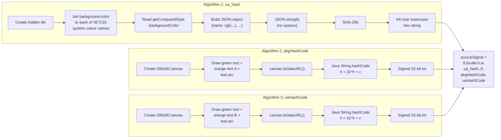

# pureJsSignal: The Browser Fingerprint Challenge

The `pureJsSignal` field is where Akamai BMP hides its most consequential fingerprinting work. Buried inside the signal string that the challenge JavaScript passes back to the native SDK via `setSignal`, it is a nine-field, comma-delimited string containing three computed values that together form a stable hardware fingerprint of the device. Five of the nine fields are static scaffolding. The three that matter --- a SHA-256 hash and two signed 32-bit integers --- are browser-engine fingerprints derived from CSS colour resolution and canvas rendering. None of them hash what their names suggest.

---

## Format

```
8,{locale},{wv_height},{wv_width},{ua_hash},,0,{pkgHashCode},{uaHashCode}
```

A concrete example from the Pixel 4a baseline (Android 13, Chrome/149 WebView):

```
8,en-US,851,393,920a650b922995f6c26c190a3e10da6aee3557b9f7753de59d05b820311f5af5,,0,956038405,-1088156997
```

### Field Table

| Position | Name | Type | Value (Pixel 4a) | Source |
|----------|------|------|-------------------|--------|
| 0 | Version tag | Static | `8` | Hardcoded in the `L4` scaffold constant |
| 1 | `locale` | Dynamic | `en-US` | Read from `navigator.language` at runtime (proven by differential test: `fr-FR` override changed it) |
| 2 | `wv_height` | Static | `851` | Hardcoded in scaffold (WebView height in dp) |
| 3 | `wv_width` | Static | `393` | Hardcoded in scaffold (WebView width in dp) |
| 4 | `ua_hash` | Computed | `920a650b...` (64 hex chars) | SHA-256 of 38 CSS system colours |
| 5 | *(empty)* | Static | *(empty string)* | Reserved positional field (produces the `,,` in the format) |
| 6 | Flag | Static | `0` | Fixed flag in scaffold |
| 7 | `pkgHashCode` | Computed | `956038405` | Java `String.hashCode` of Canvas A `toDataURL()` |
| 8 | `uaHashCode` | Computed | `-1088156997` | Java `String.hashCode` of Canvas B `toDataURL()` |

The five static fields are baked into the `L4` scaffold constant built by VM case `Q5` at JS offset ~6646. The challenge JS does not read `wv_height` or `wv_width` from the device at runtime --- they are string literals inside the VM's decoded constant table. The `locale` field, however, is read from `navigator.language` at runtime; this was proven by differential testing in CloakBrowser, where overriding `navigator.language` to `fr-FR` changed the locale field to `fr-FR`. (Some builds use different dimension values, e.g. `1080,1920` instead of `851,393`. The scaffold dimensions are per-build, not per-device.)

---

## Why the Names Lie

Akamai deliberately chose field names that misdirect reverse engineers:

- **`ua_hash`** does not hash the User-Agent string. It is the SHA-256 of 38 CSS system colour values resolved via `getComputedStyle`. Overriding `navigator.userAgent` has zero effect on this value. Overriding CSS colour resolution changes it immediately.

- **`pkgHashCode`** does not hash the package name. It is `String.hashCode` applied to the `toDataURL()` output of a canvas fingerprint rendering. Changing `appIdentifier` has zero effect. Overriding `HTMLCanvasElement.prototype.toDataURL` changes it immediately.

- **`uaHashCode`** does not hash the User-Agent either. It is the same `String.hashCode` function applied to a second, different canvas rendering. Same proof: UA override does nothing; canvas override changes the value.

This was proven through systematic differential testing in CloakBrowser, overriding one browser API at a time and observing which computed values changed. The full test matrix is documented in [Differential Testing](../part2-methodology/10-differential-testing.md).

---

## Computation Overview



All three algorithms run inside the challenge JavaScript VM. None of the values are computed by `libakamaibmp.so` or the Java layer. The native library handles sensor encryption; the Java `u7f.setSignal` callback stores the finished string verbatim without parsing or transforming it.

---

## Algorithm 1: `ua_hash` --- SHA-256 of CSS System Colours

The challenge JS creates a hidden `<div>` element and iterates through 38 CSS system colour names. For each name, it sets the element's `background-color` style to that name, reads back the computed RGB value via `getComputedStyle(element).backgroundColor`, and stores the result. The collected mapping is then serialised as JSON and SHA-256 hashed.

### The 38 Colour Names

These are legacy CSS2 system colour keywords. Different browser engines and operating systems resolve them to different RGB values, creating a stable fingerprint that varies per platform without relying on any explicit device identifier.

The colours are probed in this exact order:

| # | Colour Name | Android 13 / Chrome 149 RGB |
|---|-------------|----------------------------|
| 1 | `ActiveBorder` | `rgb(118, 118, 118)` |
| 2 | `ActiveCaption` | `rgb(255, 255, 255)` |
| 3 | `ActiveText` | `rgb(255, 0, 0)` |
| 4 | `AppWorkspace` | `rgb(255, 255, 255)` |
| 5 | `Background` | `rgb(255, 255, 255)` |
| 6 | `ButtonBorder` | `rgb(118, 118, 118)` |
| 7 | `ButtonFace` | `rgb(239, 239, 239)` |
| 8 | `ButtonHighlight` | `rgb(239, 239, 239)` |
| 9 | `ButtonShadow` | `rgb(239, 239, 239)` |
| 10 | `ButtonText` | `rgb(0, 0, 0)` |
| 11 | `Canvas` | `rgb(255, 255, 255)` |
| 12 | `CanvasText` | `rgb(0, 0, 0)` |
| 13 | `CaptionText` | `rgb(0, 0, 0)` |
| 14 | `Field` | `rgb(255, 255, 255)` |
| 15 | `FieldText` | `rgb(0, 0, 0)` |
| 16 | `GrayText` | `rgb(128, 128, 128)` |
| 17 | `Highlight` | `rgba(51, 181, 229, 0.4)` |
| 18 | `HighlightText` | `rgb(0, 0, 0)` |
| 19 | `InactiveBorder` | `rgb(118, 118, 118)` |
| 20 | `InactiveCaption` | `rgb(255, 255, 255)` |
| 21 | `InactiveCaptionText` | `rgb(128, 128, 128)` |
| 22 | `InfoBackground` | `rgb(255, 255, 255)` |
| 23 | `InfoText` | `rgb(0, 0, 0)` |
| 24 | `LinkText` | `rgb(0, 0, 238)` |
| 25 | `Mark` | `rgb(255, 255, 0)` |
| 26 | `MarkText` | `rgb(0, 0, 0)` |
| 27 | `Menu` | `rgb(255, 255, 255)` |
| 28 | `MenuText` | `rgb(0, 0, 0)` |
| 29 | `Scrollbar` | `rgb(255, 255, 255)` |
| 30 | `ThreeDDarkShadow` | `rgb(118, 118, 118)` |
| 31 | `ThreeDFace` | `rgb(239, 239, 239)` |
| 32 | `ThreeDHighlight` | `rgb(118, 118, 118)` |
| 33 | `ThreeDLightShadow` | `rgb(118, 118, 118)` |
| 34 | `ThreeDShadow` | `rgb(118, 118, 118)` |
| 35 | `VisitedText` | `rgb(85, 26, 139)` |
| 36 | `Window` | `rgb(255, 255, 255)` |
| 37 | `WindowFrame` | `rgb(118, 118, 118)` |
| 38 | `WindowText` | `rgb(0, 0, 0)` |

Note that `Highlight` returns an `rgba()` value with an alpha channel on Android WebView, whilst all other colours return `rgb()`. This is not a quirk of the fingerprinting code --- it is how Chrome on Android resolves that particular system colour. The value is stored exactly as `getComputedStyle` returns it, including the `rgba` prefix and the `0.4` alpha.

### Resolution Method

The challenge JS operates as follows (reconstructed from VM case `P5` at offset ~2880 and supporting cases):

1. Create a `<div>` element and append it to the document body.
2. For each of the 38 colour names, set `element.style.cssText = "background-color: {colourName} !important"`.
3. Read `getComputedStyle(element).backgroundColor`.
4. Build a JavaScript object mapping colour names (as keys) to their resolved RGB strings (as values), preserving insertion order.
5. Serialise with `JSON.stringify` using no spaces --- the compact format with commas and colons but no whitespace after separators.
6. SHA-256 hash the UTF-8 encoded serialised string (VM case `J5` at offset ~3653).
7. Convert the 32-byte digest to a 64-character lowercase hexadecimal string (VM case `F5` at offset ~2596).

### Why It Works as a Fingerprint

Different browser engines resolve CSS system colours differently:

- **Android WebView (Chrome 149)**: `ButtonFace` resolves to `rgb(239, 239, 239)`.
- **Windows Chrome**: `ButtonFace` resolves to `rgb(240, 240, 240)`.
- **macOS Safari**: `ButtonFace` resolves to yet another value.

Since 38 colours are probed and the hash is taken over the complete mapping, even a single colour differing produces an entirely different SHA-256 digest. This creates a unique fingerprint per browser engine and OS combination without revealing any explicit device identifier.

### Python Implementation

```python
import hashlib
import json

CSS_SYSTEM_COLORS = [
    "ActiveBorder", "ActiveCaption", "ActiveText", "AppWorkspace",
    "Background", "ButtonBorder", "ButtonFace", "ButtonHighlight",
    "ButtonShadow", "ButtonText", "Canvas", "CanvasText",
    "CaptionText", "Field", "FieldText", "GrayText",
    "Highlight", "HighlightText", "InactiveBorder", "InactiveCaption",
    "InactiveCaptionText", "InfoBackground", "InfoText", "LinkText",
    "Mark", "MarkText", "Menu", "MenuText", "Scrollbar",
    "ThreeDDarkShadow", "ThreeDFace", "ThreeDHighlight",
    "ThreeDLightShadow", "ThreeDShadow", "VisitedText",
    "Window", "WindowFrame", "WindowText",
]

def css_color_hash(color_map: dict) -> str:
    """
    Compute ua_hash from a mapping of CSS system colour names to
    their getComputedStyle().backgroundColor values.

    The serialisation must match JavaScript's JSON.stringify with
    no spaces: {"key":"value","key2":"value2"} -- compact separators.
    """
    ordered = {name: color_map[name] for name in CSS_SYSTEM_COLORS}
    serialized = json.dumps(ordered, separators=(",", ":"))
    return hashlib.sha256(serialized.encode("utf-8")).hexdigest()
```

---

## Algorithms 2 and 3: `pkgHashCode` / `uaHashCode` --- Canvas Fingerprinting

Both values use the same pipeline: draw a specific image on an HTML5 `<canvas>`, call `toDataURL()` to get the base64-encoded PNG, and hash the resulting string with Java's `String.hashCode` algorithm. The two canvases differ only in the text drawn via `fillText` --- every other drawing operation is identical.

### The Hash Function: Java `String.hashCode`

```
h = 0
for each character c in string:
    h = (31 * h + charCode(c)) mod 2^32
return h as signed 32-bit integer
```

This is the well-known Java `String.hashCode()` algorithm. It operates on characters (UTF-16 code units), accumulates with a multiplier of 31, and wraps at 32 bits. The result is interpreted as a signed integer, meaning values above `0x7FFFFFFF` appear as negative numbers in the output.

```python
def java_string_hashcode(s: str) -> int:
    """Java String.hashCode(): h = 31*h + c, signed 32-bit."""
    h = 0
    for c in s:
        h = ((h * 31) + ord(c)) & 0xFFFFFFFF
    # Convert to signed 32-bit
    return h - 0x100000000 if h >= 0x80000000 else h
```

### Canvas Drawing Specification

Both canvases use the following drawing sequence on a 280 x 60 pixel canvas:

| Step | API Call | Parameters | Visual Effect |
|------|----------|------------|---------------|
| 1 | `createElement('canvas')` | `width=280, height=60` | Create the canvas |
| 2 | `ctx.fillStyle =` | `'rgb(102, 204, 0)'` | Set fill to green |
| 3 | `ctx.fillRect(...)` | `100, 5, 80, 50` | Draw green rectangle |
| 4 | `ctx.fillStyle =` | `'#f60'` | Set fill to orange |
| 5 | `ctx.font =` | `'16pt Arial'` | Set font |
| 6 | `ctx.fillText(TEXT, ...)` | `TEXT, 10, 40` | Draw text (**differs per canvas**) |
| 7 | `ctx.strokeStyle =` | `'rgb(120, 186, 176)'` | Set stroke to teal |
| 8 | `ctx.arc(...)` | `80, 10, 20, 0, Math.PI, false` | Draw semicircular arc |
| 9 | `ctx.stroke()` | | Render the arc stroke |
| 10 | `canvas.toDataURL()` | | Export as `data:image/png;base64,...` |

The combination of a filled rectangle, text rendering with a specific font, and an arc produces pixel output that varies subtly across GPU drivers, font rendering engines, and anti-aliasing implementations. This variation is the fingerprint.

### Two Canvases, Two Texts

Each polymorphic build of the challenge JS embeds two `fillText` strings as decoded constants from the VM's string table. For the June 2026 build captured from the Argos app:

| Canvas | `fillText` String | `toDataURL` Length | Hash | Field |
|--------|-------------------|-------------------|------|-------|
| **A** | `<@nv45. F1n63r,Pr1n71n6!` | 7,926 chars | `956038405` | `pkgHashCode` |
| **B** | `m,Ev!xV67BaU> eh2m<f3AG3@` | 8,850 chars | `-1088156997` | `uaHashCode` |

The text strings are deliberately chosen to contain a mix of symbols, digits, and letters that exercise different font rendering code paths. Different text produces different pixel output, different PNG encoding, different base64, and therefore different hash codes --- even on the same device. This is intentional: it gives Akamai two independent canvas fingerprints per challenge build, making it harder to spoof one without spoofing both consistently.

When both canvases are overridden to return the same constant `toDataURL()` value, both hash codes collapse to the same number --- proving they use the same hash function and differ only in their canvas input.

### Why `String.hashCode` and Not Something Stronger?

Java `String.hashCode` is a 32-bit non-cryptographic hash with known collision properties. Akamai does not need collision resistance here. The purpose is not to protect a secret --- it is to reduce a ~8,000-character base64 string to a compact integer that can be compared server-side. The server stores the expected canvas hash for known device/GPU/WebView combinations and flags deviations. A 32-bit hash with two independent canvases gives a combined 64-bit fingerprint space, which is more than sufficient for device discrimination.

### Python Implementation

```python
def canvas_fingerprint_hash(canvas_data_url: str) -> int:
    """
    Hash a canvas toDataURL() string using Java String.hashCode.

    The input is the full data URL including the 'data:image/png;base64,'
    prefix and the base64-encoded PNG data.
    """
    return java_string_hashcode(canvas_data_url)
```

The difficulty lies not in the hash function but in reproducing the canvas rendering. The `toDataURL()` output is GPU-dependent: two devices with different GPUs, drivers, or even different Chrome WebView versions will produce different PNG data for the same drawing operations. This is why the recommended approach is to capture the values once from a real device via Frida and cache them, rather than attempting to render pixel-perfect matching canvases.

---

## Calibration Proofs

Two calibration values confirm correct implementation of the algorithms.

### Hash Function Calibration

```python
assert java_string_hashcode(
    "data:image/png;base64,FAKE_CONSTANT_CANVAS_FINGERPRINT"
) == -1793983051
```

This was verified by overriding `HTMLCanvasElement.prototype.toDataURL` in CloakBrowser to return the constant string `"data:image/png;base64,FAKE_CONSTANT_CANVAS_FINGERPRINT"`. Both `pkgHashCode` and `uaHashCode` in the resulting pureJsSignal changed to `-1793983051`, confirming the hash function and proving that both canvases feed through the same code path.

### CSS Colour Hash Calibration

```python
assert css_color_hash(ANDROID_13_CHROME149_COLORS) == \
    "920a650b922995f6c26c190a3e10da6aee3557b9f7753de59d05b820311f5af5"
```

The `ANDROID_13_CHROME149_COLORS` mapping is the 38-entry dictionary shown in the colour table above. Feeding it through `css_color_hash` (JSON serialisation with compact separators, then SHA-256) produces the exact `ua_hash` value captured from the Pixel 4a via Frida --- confirming the serialisation format, character encoding, and hash algorithm.

---

## Assembly: From Three Values to One String

The pureJsSignal string is assembled by VM case `P5` (offset ~2880 in the challenge JS). The process is straightforward: the `L4` scaffold constant already contains the static prefix (`8,en-US,851,393,`) and the three computed values are spliced into their positions:

```
"8," + locale + "," + wv_height + "," + wv_width + ","
    + ua_hash + ",,0," + pkgHashCode + "," + uaHashCode
```

The scaffold is built once during VM initialisation (case `Q5`) and reused. The computed values are inserted at signal assembly time.

### Complete Python Assembly

```python
def build_pure_js_signal(
    locale: str = "en-US",
    wv_height: int = 851,
    wv_width: int = 393,
    ua_hash: str = "",
    pkg_hash_code: int = 0,
    ua_hash_code: int = 0,
) -> str:
    """Build the pureJsSignal value string."""
    return (
        f"8,{locale},{wv_height},{wv_width},"
        f"{ua_hash},,0,{pkg_hash_code},{ua_hash_code}"
    )
```

The pureJsSignal is then embedded in the larger signal string passed to `setSignal`:

```
screenHeight={h}#screenWidth={w}#startTime={ts}#serverSideSignal={ss}#pureJsSignal={pjs}#mapping_flag=1
```

This signal string becomes field `-90` in the sensor plaintext, the single largest field in the 30-field payload.

---

## Stability and Caching

All three computed values are **device-stable per WebView version**:

- **`ua_hash`** depends on how the Chrome WebView engine resolves CSS system colours. This is determined by the Chromium version and the host OS, not by per-session state. A Pixel 4a running Android 13 with Chrome 149 will always produce `920a650b...`. A Samsung Galaxy S23 running Android 14 with Chrome 150 may produce a different hash, but it will produce the same hash every time on that device.

- **`pkgHashCode` and `uaHashCode`** depend on how the GPU and font engine render the canvas drawing. This is determined by the GPU driver, the system font configuration, and the Chrome WebView version. The rendering is deterministic for a given hardware and software combination.

None of the three values depend on the package name, user agent string, `serverSideSignal`, `appIdentifier`, or any data passed through the `@JavascriptInterface` bridge. They are pure browser-engine fingerprints.

The practical consequence: capture these three values once from a real device using Frida (`tools/frida-capture-purejs-cache.js`), store them in a device profile, and reuse them for all subsequent sensor generation. They remain valid until the device's Chrome WebView is updated to a new major version.

---

## Where This Runs

The entire pureJsSignal computation --- all three algorithms, the scaffold construction, and the final string assembly --- executes inside the challenge JavaScript VM running in the hidden Android WebView. This was confirmed from three independent directions:

1. **Native library exclusion.** `libakamaibmp.so` exports exactly five JNI methods (`initializeKeyN`, `encryptKeyN`, `decryptN`, `buildN`, and test stubs). None relate to signal computation. The library contains SHA-256 constants (for sensor encryption) but zero MurmurHash3 constants and zero occurrences of the strings `pureJsSignal`, `mapping_flag`, or `en-US`. The native SHA-256 serves the encryption pipeline, not the fingerprint.

2. **Java layer exclusion.** `u7f.setSignal(String str)` stores its argument verbatim: `this.b = str; done();`. No parsing, no hashing, no transformation. A grep across all 20,991 decompiled Java files for `MessageDigest`, `getInstance`, `.hashCode()`, or `SHA-256` produced zero hits in the signal path. The Java layer is a ferry, not a factory.

3. **JS VM confirmation.** The VM dispatch analysis identifies the exact case handlers: `P5` (builder), `J5` (SHA-256), `F5` (hex encoding). The string `pureJsSignal=8,en-US,851,393,...` appears only in the decoded VM string tables --- it is a constant inside the challenge JS's obfuscation layer, never present in native code or Java.

For the full evidence chain, see the [native library analysis](../../knowledge/targets/akamai-bmp/purejs-signal-native.md) and [VM dispatch analysis](../../knowledge/targets/akamai-bmp/vm-dispatch-analysis.md) in the knowledge base.
