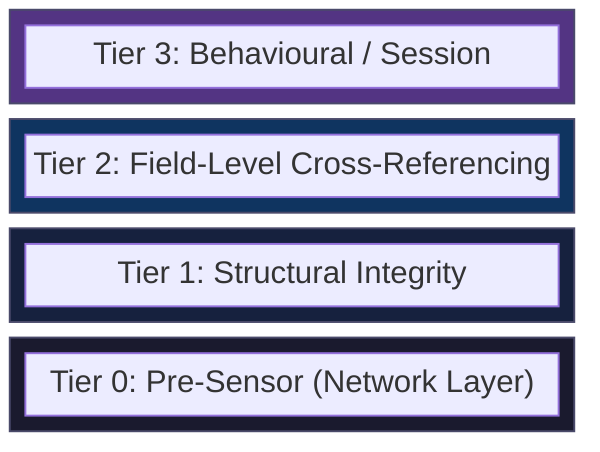

# What Akamai Validates Server-Side

When an `x-acf-sensor-data` header arrives at Akamai's edge, it does not pass through a single yes-or-no gate. Based on differential testing (60+ sensor submissions with varying configurations, captured `server-timing` headers, and structural analysis of the sensor format), the validation appears to operate as a four-tier pipeline that evaluates the request at increasing depth -- from network-layer signals that require no decryption at all, through structural integrity checks on the encrypted envelope, to field-level cross-referencing of the decrypted sensor contents, and finally to behavioural and session-level analysis that spans multiple requests over time. This model is inferred from observed behaviour, not confirmed Akamai architecture; the actual server-side implementation may differ in structure whilst producing the same observable effects.

Each tier acts as a filter. A request that fails at Tier 0 is rejected before the server ever attempts RSA key recovery. A request that passes Tier 0 but fails at Tier 1 is rejected before individual fields are inspected. This layered design means that getting the sensor payload "right" is necessary but not sufficient -- the network fingerprint, the TLS handshake, the encryption envelope, the field values, and the session behaviour must all be consistent with a genuine mobile app running on a real device.

---

## The 4-Tier Validation Model

The pyramid narrows at each tier. Most illegitimate traffic is eliminated at Tier 0 and Tier 1 without expensive cryptographic or statistical analysis. Only requests that survive the first three tiers reach the behavioural engine, which operates across the full session history.

---

## Tier 0: Pre-Sensor Checks

Tier 0 runs before the server touches the sensor payload. These checks evaluate the network connection itself -- the TCP handshake, the TLS negotiation, and the HTTP framing. No decryption is performed; no sensor bytes are read.

### IP Reputation

Akamai maintains an IP reputation database. Datacenter IP ranges (AWS, GCP, Azure, Hetzner, OVH, and similar providers) carry a negative reputation score by default. Residential IPs start with a neutral or positive score. Previous bot activity from an IP degrades its reputation; sustained legitimate traffic improves it.

IP reputation is not binary. A datacenter IP is not automatically blocked -- it starts with a deficit that must be overcome by consistent, high-quality sensor submissions. Conversely, a residential IP that sends malformed sensors will see its reputation degrade over time.

### TLS Fingerprint (JA3/JA4)

The server extracts a TLS fingerprint from the ClientHello message during the TLS handshake. This fingerprint (commonly referred to as JA3 or its successor JA4) encodes the cipher suites, extensions, supported groups, and signature algorithms offered by the client. The fingerprint is compared against the claimed User-Agent.

For the Argos Android app, the expected TLS fingerprint matches OkHttp 4 on Android 13. Sending a sensor with the correct `Argos/2042300(phone-v2; Android 13; Scale/2.75)` User-Agent but connecting with a Python `requests` or raw `curl` TLS stack produces an immediate 403 -- the TLS fingerprint mismatch is caught before the sensor is evaluated. Using `tls_client` with the `okhttp4_android_13` profile resolves this.

### TCP/IP Passive Fingerprint (p0f)

Akamai uses passive OS fingerprinting (p0f-style analysis) on TCP SYN packets to determine the client's operating system from low-level TCP/IP stack behaviour: initial TTL, window size, MSS, window scaling factor, and TCP options ordering. A request claiming to be Android but arriving with a Windows TCP stack is flagged.

### HTTP/2 SETTINGS Frame Fingerprint

Modern HTTP/2 clients send a SETTINGS frame at connection start that declares parameters such as `INITIAL_WINDOW_SIZE`, `MAX_CONCURRENT_STREAMS`, `HEADER_TABLE_SIZE`, and the order in which these settings appear. OkHttp, Chrome, Firefox, and curl all produce distinct SETTINGS fingerprints. The server validates that the SETTINGS frame matches the expected client implementation.

---

## Tier 1: Structural Validation

Tier 1 runs after the server receives the `x-acf-sensor-data` header and attempts to parse and decrypt its contents. These checks validate the cryptographic envelope and the structural format of the sensor, without yet inspecting individual field values.

### RSA Key Recovery

The sensor header contains two RSA-1024-PKCS1v15 encrypted blobs: the AES-128 session key and the HMAC-SHA256 key. The server uses its RSA private key to recover both. If decryption fails -- because the client used a wrong or fabricated public key -- the request is rejected immediately.

Successful RSA key recovery is itself a validation signal. It proves the client possessed Akamai's genuine RSA public key, which is distributed through the SDK and challenge JS. A forged sensor that uses a random RSA key pair will fail at this step regardless of how well the plaintext fields are constructed.

### HMAC-SHA256 Integrity Check

After recovering the HMAC key, the server computes HMAC-SHA256 over the AES ciphertext and compares it against the HMAC tag appended to the payload. This detects any modification of the encrypted sensor in transit -- whether accidental corruption, proxy interference, or deliberate tampering.

### AES Block Alignment

The AES-CBC ciphertext must be an exact multiple of the 16-byte block size. Payloads that are not correctly padded fail decryption. This catches truncated or malformed payloads before field parsing begins.

### Sensor Format Integrity

After AES decryption, the server validates the plaintext structure: the `6,a,` version prefix, the `-1,2,-94,` field delimiter pattern, and the expected field count (30 fields in v4.0.4). A plaintext that does not match the expected format -- wrong delimiter, missing fields, extra fields -- is rejected.

---

## Tier 2: Field-Level Cross-Referencing

Tier 2 is where the server inspects the actual values within the decrypted sensor plaintext. Each field is validated not just for format, but for internal consistency with other fields and with server-side state.

### CRC Triplet Cross-Validation

The sensor contains three CRC checksums in the `-100` field slots (positions 37--39). Each is computed by a distinct method: `crc1` is the sum of ASCII codepoints below 128 in the fingerprint body preceding the checksums, `crc2` is a random signed 32-bit integer (genuinely random in the real SDK), and `crc3` is `timestamp_ms // 2`. The server recomputes `crc1` and `crc3` from the other fields in the sensor and the request timestamp, and compares. If either checksum does not match the values derived from the declared device properties and timing, the sensor is flagged.

This is a particularly effective anti-forgery measure because the CRC inputs span multiple fields. Getting one field wrong cascades into a CRC mismatch even if the CRC computation itself is correct.

### pureJsSignal Hash Verification

The `pureJsSignal` field contains three computed hashes: `ua_hash` (SHA-256 of CSS system colour values), `pkgHashCode` (Java `String.hashCode` of canvas rendering A), and `uaHashCode` (Java `String.hashCode` of canvas rendering B). The server validates these against the expected output of the challenge JS for the declared device properties.

The challenge JS is polymorphic -- each serve generates a new variant with different variable names and integrity seeds -- but the underlying algorithms are deterministic. Given the same device (OS version, Chrome WebView version, GPU driver), the same three hash values must appear. The server knows what the challenge JS would produce for any given device configuration and can detect fabricated or replayed hashes.

### serverSideSignal Session Binding

The `serverSideSignal` is a session-specific challenge token issued by the Akamai edge during SDK initialisation. The server checks that the token in the sensor matches the one it issued for this session. Stale tokens (from a previous session), tokens from a different device, or cross-session token reuse are rejected.

### Timestamp Consistency

The `startTime` field in the `-90` slot must remain identical across all sensors within a single session. It is set once during SDK initialisation and never changes. A generator that randomises `startTime` per sensor, or that reuses a `startTime` from a different session, will fail this check.

### Performance Metrics Stability

The `-112` field contains performance metrics (navigation timing, resource loading times) that are captured once at app initialisation. These values must be session-static -- identical in every sensor submitted during the session. Randomising them per sensor, or using values that are inconsistent with the declared device and network conditions, triggers a flag.

### MT19937 Mathematical Verification

The sensor includes PRNG verification values in the `-172` and `-170` fields. These are outputs from a Mersenne Twister (MT19937) seeded with a known value. The server can mathematically verify that the submitted values are valid MT19937 outputs for the declared seed -- not random numbers, not constants, but provably correct PRNG states. This is one of the strongest anti-forgery checks: a generator that does not implement MT19937 correctly will produce values that are mathematically impossible.

---

## Tier 3: Behavioural and Session-Level Validation

Tier 3 operates across the full session, evaluating patterns that only emerge over multiple requests and over time.

### Sensor Cadence

Sensors must arrive at intervals consistent with real app navigation. A burst of 50 sensors in one second is not consistent with a human using the Argos app. The server expects sensors to arrive at natural intervals -- a few seconds between page navigations, longer pauses during product browsing, shorter intervals during checkout flows.

### Counter Progression

Timing triplets and interaction counters within the sensor must show monotonic growth across consecutive sensors in a session. Each sensor should reflect more elapsed time and more user interactions than the previous one. A session where counters reset, jump backwards, or remain static across sensors is flagged.

### Cookie Chain Progression

In the mobile app flow, the Akamai cookie lifecycle follows a specific sequence: `bm_sz` is set by the edge on the very first API response (no sensor required), then `ak_bmsc` is issued only after a valid BMP sensor is accepted via the `x-acf-sensor-data` header. The server validates that this progression occurs in the correct order. A request that arrives with `ak_bmsc` but without a prior `bm_sz` is inconsistent. (Note: the web flow uses a different cookie chain centred on `_abck`, which is not relevant to the mobile SDK path.)

### Attestation Validation

The `$$$` suffix of the sensor contains a 254-byte device attestation blob (`pke.f`) issued during the SDK initialisation handshake. The server validates this blob against its own record of the handshake. The attestation cannot be independently generated -- it must be captured from a real device session via the SDK's initialisation flow. Replaying an attestation from a different session or device is detected.

### IP Trust Budget

The trust budget is perhaps the most consequential Tier 3 mechanism. It operates as a running account per IP address:

- Each valid sensor submission from a genuine device **increments** the trust budget.
- Each anomalous session (mismatched RSA keys, inconsistent CRCs, rapid-fire requests, failed HMAC checks) **decrements** it.
- The trust budget determines whether borderline sensors -- those that pass Tiers 0--2 but have minor anomalies -- are accepted or rejected.

A fresh IP with no history has zero trust budget. A datacenter IP starts with negative trust. A residential IP that has been used by the real Argos app for weeks carries substantial positive trust.

---

## Validation Tier Summary

| Tier | Stage | What Is Checked | Runs Before Decryption? | Cost |
|------|-------|-----------------|------------------------|------|
| **0** | Pre-sensor | IP reputation, JA3/JA4 TLS fingerprint, p0f TCP/IP fingerprint, HTTP/2 SETTINGS frame | Yes | Negligible |
| **1** | Structural | RSA key recovery, HMAC-SHA256 integrity, AES block alignment, sensor format (version prefix, delimiter, field count) | Partially (RSA + AES decryption occurs here) | Low |
| **2** | Field-level | CRC triplet consistency, pureJsSignal hash verification, serverSideSignal session binding, timestamp consistency, performance metrics stability, MT19937 PRNG verification | No | Medium |
| **3** | Behavioural | Sensor cadence, counter progression, cookie chain progression, attestation validation, IP trust budget | No | High (session-spanning) |

---

## Scoring Outcome

The output of the four-tier pipeline is a composite **bot score** visible in the `server-timing` HTTP response header as `field5`. This score is not a simple pass/fail flag -- it is a numeric value that determines how the edge treats the request.

### Score Ranges

| Score | Meaning | Effect |
|-------|---------|--------|
| **2--6** | Genuine device, high confidence | Request passes to origin. In observed captures, the real Argos app on a physical Pixel 4a produces field5=28--35 on early requests (initial page loads, product detail), dropping to field5=3--6 as the session progresses and trust is built. The successful cart-add captured from the real app had field5=6. |
| **4--9** | Suspicious but not conclusive | May pass for low-sensitivity endpoints (product pages, availability checks). May be blocked for high-sensitivity endpoints (cart operations, checkout). |
| **10+** | Bot or anomalous client | Blocked for app-exclusive endpoints. Returns HTTP 403 or HTTP 400 depending on the endpoint configuration. |

The score is not determined by any single tier. A request with a perfect sensor payload but a datacenter IP and a mismatched TLS fingerprint will score high. A request with a slightly imperfect sensor but strong IP trust and correct TLS may still pass. The tiers contribute weighted signals to the final score.

### Trust Budget Mechanics

The trust budget creates a feedback loop between the bot score and future scoring decisions:

1. **Building trust:** A real device submitting valid sensors from a residential IP accumulates trust over time. Each successful sensor-response cycle adds to the budget. After dozens of valid submissions, the IP has substantial trust.

2. **Spending trust:** When a synthetic sensor is submitted from the same IP, the trust budget absorbs minor anomalies. The synthetic sensor may score a 4 or 5 instead of a 10 -- still within the passing range for some endpoints.

3. **Depleting trust:** Each anomalous submission draws down the budget. After several failed or suspicious submissions, the budget is exhausted and subsequent requests are scored without the trust cushion.

### Empirical Evidence

During the development of our generator, we ran 60 synthetic sensor submissions against the live Argos API from a residential IP. Exactly one of the 60 succeeded -- and it succeeded immediately after the real Argos app had been used on the same IP, building up trust through 20+ valid sensor submissions from the physical Pixel 4a.

This single success confirmed two things: first, that the synthetic sensor was structurally close enough to pass Tiers 0--2 (otherwise no amount of trust would help); and second, that the IP trust budget was the decisive factor at Tier 3 -- the same sensor that failed 59 times passed once when the trust budget was at its peak.

The subsequent generator improvements -- fixing the CRC triplet computation, correcting the MT19937 seeding, and matching the performance metrics format -- eliminated the need for trust budget assistance entirely. The final generator achieves 80 consecutive HTTP 200 responses at 1 request per second with zero blocks, demonstrating that a sensor which passes all four tiers cleanly does not depend on accumulated trust.

---

## Implications for Sensor Generation

Understanding the four-tier model has direct implications for building a working sensor generator:

- **Tier 0 cannot be solved in the sensor.** The TLS fingerprint, TCP stack, and HTTP/2 framing must be correct at the network layer. This means using `tls_client` with the `okhttp4_android_13` profile (or equivalent), not a standard HTTP library.

- **Tier 1 requires real cryptography.** The RSA public key must be Akamai's genuine key. The AES and HMAC operations must be implemented correctly. There are no shortcuts here -- the server will reject any envelope it cannot decrypt.

- **Tier 2 requires understanding every field.** Getting 29 out of 30 fields right is not enough if the one wrong field is a CRC input. The CRC triplet, pureJsSignal hashes, and MT19937 values are the hardest Tier 2 checks because they require exact algorithm reimplementation, not just plausible-looking values.

- **Tier 3 requires session discipline.** Timestamps must be consistent within a session. Counters must progress monotonically. The attestation token must come from a real device initialisation. And the IP trust budget means that testing from a datacenter IP will always be harder than testing from a residential connection where a real device has built trust.

The four tiers work together as a defence-in-depth system. Each tier catches a different class of attack, and a sensor generator must satisfy all four simultaneously to achieve sustained, reliable access.
