# Reverse Engineering Journey: Overview

## Scope

This section documents the complete reverse engineering process for the Akamai BMP mobile SDK challenge JS (`sdk_challenge.js`), from first encounter to 80 consecutive requests passing Akamai's validation at one request per second with zero blocks. The work spanned approximately **12 hours of continuous analysis** across static analysis, Node.js harness development, Frida instrumentation, Ghidra binary analysis, APK decompilation, CloakBrowser dynamic testing, and differential fingerprint isolation.

The numbers tell the story of how much ground was covered:

| Metric | Value |
|--------|-------|
| Total analysis time | ~12 hours continuous |
| Frida scripts written | ~47 (hooks, captures, traces, injection helpers) |
| buildN captures analysed | 189 across 6 capture sessions |
| Tools used | Frida, Ghidra, CloakBrowser, Node.js, androguard, JADX, tls_client |
| Java files decompiled | 20,991 (full Argos APK) |
| Hash algorithms tested | CRC32, DJB2, FNV-1a, MurmurHash3 (seeds 0--2M), Adler32, Java String.hashCode |
| Final pass rate | 80/80 HTTP 200 responses over 2 minutes |

---

## The Insight Chain

Every dead end in this project produced the insight that led to the next breakthrough. This was not a linear process of steady progress -- it was a series of wrong assumptions, each disproved by evidence, each failure narrowing the search space until the correct answer became unavoidable.

The pattern repeated throughout: form a hypothesis, test it exhaustively, prove it wrong, extract the lesson, pivot. The willingness to abandon assumptions when evidence contradicted them -- particularly the belief that `pureJsSignal` was native code (wrong) and that the local JS file was complete (wrong) -- made the difference between stalling and progressing.

---

## Dead Ends and Breakthroughs

The following table lists every significant dead end and breakthrough in chronological order. Each dead end directly produced the insight that enabled the breakthrough below or beside it.

| # | Dead End | Breakthrough |
|---|----------|-------------|
| 1 | **Naive Node.js eval** -- silent failure, no errors, no output. The self-integrity check produced the wrong seed value in a non-browser context, causing every string table lookup to return garbage. | **Intl requirement discovery** -- the VM aborted silently because `Intl.DateTimeFormat` was missing. Adding `Intl` to the Node.js global broke the first deadlock and revealed the bridge communication pattern. |
| 2 | **Progressive window mock expansion** -- 5+ iterations adding browser globals (`navigator`, `document`, `screen`, `crypto`, `Proxy` wrappers). Each fix exposed a new crash. The approach was fundamentally fragile because decoded property names are unpredictable without running the full VM. | **Dual-path bridge discovery** -- analysis of the bridge wiring revealed two communication paths: Android sync (`JSBridge.method()`) and iOS async (`postMessage`/`setRes` callback). Exercising the iOS path in Node.js finally produced a valid signal output. |
| 3 | **Searching for hash patterns** -- grepped for `*31` (Java hashCode), `*33` (DJB2), `<<5`, and `5381` across the entire 54KB source. Found nothing. MurmurHash3 (`xg`) is called exactly once, only for the integrity check. | **Frida WebView.loadData hook** -- hooking `WebView.loadData` on the Pixel 4a revealed the actual HTML loaded into the hidden WebView: a script tag fetching JS live from `/_sec/sdk_challenge.js` on Akamai's CDN. |
| 4 | **Assuming pureJsSignal was in the local 54KB file** -- exhaustively probed all 54 order keys (`w1`--`w54`). Every key produced the same `cf-sdk-1-00-0.js#field=value#...#sha256tail` format. Zero produced `pureJsSignal`. | **Fetching live polymorphic JS** -- the server-delivered file was 58KB, not 54KB. The extra 4KB contained 21 additional functions implementing the entire pureJsSignal computation pipeline, absent from our local copy. |
| 5 | **Assuming pureJsSignal was in libakamaibmp.so** -- Ghidra analysis of the 1.9MB native binary found zero MurmurHash constants, zero signal-assembly strings, and only encryption-related JNI exports (`buildN`, `encryptKeyN`). | **CloakBrowser execution with real hash values** -- running the live 58KB JS in CloakBrowser (stealth Chromium with full browser APIs) produced a structurally valid pureJsSignal with real hash values for the first time. |
| 6 | **Brute-forcing MurmurHash3 seeds 0--2M** -- tested two million seeds against the known hash codes. No match, because the function was not MurmurHash3 at all. | **Differential testing matrix** -- systematically overriding single browser properties in CloakBrowser and comparing output. Faking `canvas.toDataURL` to a constant made both hash codes identical (-1793983051), proving they use the same hash function on different canvas inputs. |
| 7 | **Multiple Frida browser-API tracing attempts** -- WebChromeClient hooks, logcat capture, `evaluateJavascript` injection. Console output from injected JS does not reach Frida's console in most configurations. | **Java String.hashCode calibration match** -- testing the faked-canvas value against every common 32-bit hash algorithm. Java `String.hashCode` returned `-1793983051` exactly. The VM implements `*31` across multiple opcodes, invisible to static grep. |
|   | | **CSS system colour capture** -- Frida-injected hooks captured the 38 CSS system colour values from the real WebView. SHA-256 of the serialised colour map matched `ua_hash` exactly, completing the final algorithm. |

---

## Timeline

The following diagram shows the 11 analysis phases, with dead ends marked in red and breakthroughs in green. The project moved through static analysis, harness development, native code investigation, dynamic instrumentation, and differential testing before arriving at the final verification.

```mermaid
timeline
    title Akamai BMP Reverse Engineering Timeline (~12 hours)

    section Phase 1 -- Static Analysis
        Analysed 54KB obfuscated JS : Mapped VM dispatch, string pools, integrity system
        Dead End -- Hash pattern search found nothing : No *31, *33, DJB2 in source

    section Phase 2 -- Node.js Harness
        Dead End -- Naive eval silent failure : Integrity check wrong in non-browser context
        Dead End -- 5+ window mock iterations : Each fix exposed new crash
        Breakthrough -- Intl requirement : Unblocked VM initialisation
        Breakthrough -- Dual-path bridge : iOS async path worked in Node.js

    section Phase 3 -- Native Code
        Dead End -- Assumed pureJsSignal in .so : Ghidra found zero evidence

    section Phase 4 -- APK Decompilation
        Decompiled 20,991 Java files : setSignal is a passthrough, JS produces everything

    section Phase 5 -- Frida Breakthrough
        Breakthrough -- WebView.loadData hook : Revealed live JS fetch from CDN

    section Phase 6 -- Live JS Discovery
        Dead End -- Local 54KB file incomplete : Missing pureJsSignal module entirely
        Breakthrough -- Fetched 58KB live JS : Extra 4KB contained the fingerprint pipeline

    section Phase 7 -- CloakBrowser Execution
        Breakthrough -- Real hash values produced : First valid pureJsSignal from stealth browser

    section Phase 8 -- Differential Testing
        Breakthrough -- Testing matrix : Isolated CSS colours, canvas inputs per hash

    section Phase 9 -- Algorithm ID
        Dead End -- MurmurHash3 brute-force : 2M seeds, zero matches
        Dead End -- Multiple Frida trace attempts : Console output unreachable
        Breakthrough -- Java String.hashCode match : Calibration value -1793983051 exact

    section Phase 10 -- Capture
        Breakthrough -- CSS system colour capture : 38 colours, SHA-256 matched ua_hash
        Captured canvas drawing operations : Both canvases 280x60, per-build fillText strings

    section Phase 11 -- Verification
        80/80 HTTP 200 at 1 req/sec : Zero blocks over 2 minutes sustained
```

---

## Reading Guide

The remaining pages in this section walk through the methodology in detail:

- **[Static Analysis](08-static-analysis.md)** -- Phases 1--4: VM architecture, string table decoding, integrity system, the Node.js harness saga, and the native code dead end.
- **[Frida Breakthrough](09-frida-breakthrough.md)** -- Phases 5--6: WebView.loadData hook, live polymorphic JS discovery, and the missing 4KB.
- **[Differential Testing](10-differential-testing.md)** -- Phases 7--9: CloakBrowser execution, the override matrix, algorithm identification via calibration values.
- **[Final Verification](11-final-verification.md)** -- Phases 10--11: CSS colour capture, canvas operation recording, generator update, and the 80/80 pass-rate proof.
- **[Lessons Learned](12-lessons-learned.md)** -- What transfers to other targets: the principle that dead ends are data, the value of differential testing over static analysis, and why "it probably does X" is never acceptable.

Every claim in these pages cites a specific bytecode offset, Frida capture output, Ghidra address, or tool execution result. No statements are made without evidence.
