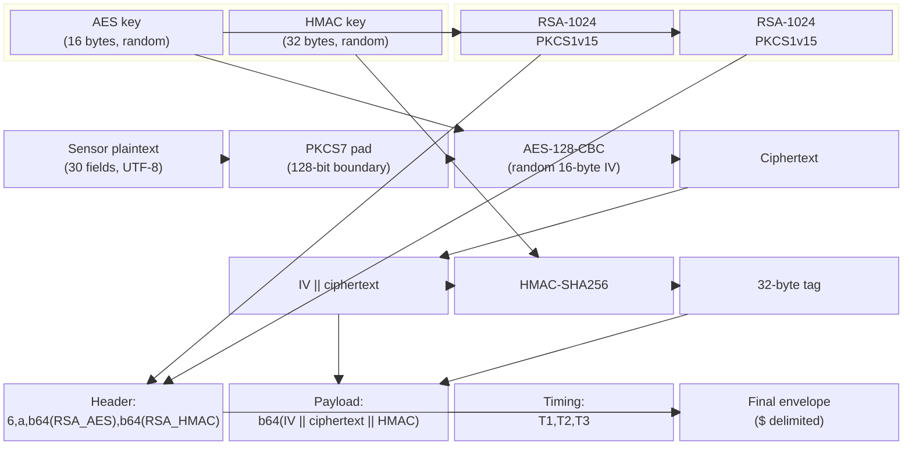

# Encryption Specification

The `x-acf-sensor-data` header uses a hybrid encryption scheme: RSA-1024-PKCS1v15 for key transport, AES-128-CBC for bulk payload encryption, and HMAC-SHA256 for integrity verification. This page specifies every cryptographic parameter, the envelope wire format, key lifecycle semantics, and the exact byte layout of the encrypted blob. All details were verified against `libakamaibmp.so` (Ghidra static analysis at the SHA-256 K-table offset `0x2925c0`) and confirmed by differential testing against the live Akamai edge.

---

## Cryptographic Parameters

| Parameter | Value |
|-----------|-------|
| RSA key size | 1024 bits (128 bytes) |
| RSA padding | PKCS#1 v1.5 |
| RSA input (AES key) | 16 bytes |
| RSA input (HMAC key) | 32 bytes |
| RSA ciphertext length | 128 bytes per key block |
| AES mode | CBC (Cipher Block Chaining) |
| AES key size | 128 bits (16 bytes) |
| AES block size | 128 bits (16 bytes) |
| AES padding | PKCS7 |
| IV | 16 bytes, random per sensor |
| HMAC algorithm | SHA-256 |
| HMAC key size | 256 bits (32 bytes) |
| HMAC tag size | 32 bytes |
| HMAC input | IV &#124;&#124; ciphertext |

---

## Envelope Wire Format

The final `x-acf-sensor-data` header value is assembled from three segments separated by `$` delimiters, with a mandatory fourth attestation segment separated by `$$$`:

```
6,a,{b64(RSA(AES_key))},{b64(RSA(HMAC_key))}${b64(IV||ciphertext||HMAC)}${T1},{T2},{T3}$$${attestation}
```

### Segment breakdown

| Segment | Content | Example length |
|---------|---------|----------------|
| Header | `6,a,` + Base64-encoded RSA-wrapped AES key + `,` + Base64-encoded RSA-wrapped HMAC key | ~356 chars |
| Payload | Base64-encoded binary blob: IV (16B) + ciphertext (variable) + HMAC tag (32B) | ~1200--2400 chars |
| Timing | Three comma-separated integers: `T1,T2,T3` | 8--12 chars |
| Attestation | URL-encoded device attestation blob (after `$$$` delimiter); mandatory — sensors missing it score 70+ (instant reject) | ~372 chars |

The `6` is the envelope format version. The `a` is a sub-version marker. Both are fixed in BMP v4.0.4 and have not changed across any observed SDK version.

---

## Encryption Pipeline

The following diagram shows the full encryption pipeline from plaintext sensor to assembled envelope.



---

## RSA-1024 Key Wrapping

The RSA public key is a 1024-bit key embedded in the native SDK binary (`libakamaibmp.so`). It is **not** fetched at runtime --- it is compiled into the shared library and extracted during Ghidra analysis. The key is also present in the Python generator source. We do not reproduce the PEM here; refer to the `RSA_KEY` constant in `bmp_generator.py`.

Two separate RSA encryption operations are performed per session:

1. **AES key wrapping** --- the 16-byte AES-128 key is encrypted under RSA-1024-PKCS1v15, producing a 128-byte ciphertext. This is Base64-encoded to approximately 172 characters.
2. **HMAC key wrapping** --- the 32-byte HMAC-SHA256 key is encrypted under the same RSA public key with the same PKCS1v15 padding, producing another 128-byte ciphertext. Also Base64-encoded to approximately 172 characters.

Both wrapped keys are placed in the envelope header, separated by a comma. The server recovers the symmetric keys by RSA-decrypting these blocks with its private key, then uses the recovered AES key to decrypt the payload and the recovered HMAC key to verify integrity.

### Why RSA-1024?

RSA-1024 is considered weak by modern standards (NIST deprecated it in 2013). However, Akamai's threat model does not rely on RSA for long-term confidentiality. The sensor payloads are ephemeral --- they are validated within seconds and discarded. The RSA layer exists to prevent attackers from decrypting captured sensors to study the plaintext format. An attacker who extracts the public key can encrypt but never decrypt, which is sufficient for Akamai's purposes. We bypassed this entirely through Frida instrumentation of `setSignal()`, which captures the plaintext before encryption.

---

## AES-128-CBC Encryption

Each sensor is encrypted with AES-128-CBC using a fresh random IV and the session's AES key.

### Procedure

1. **IV generation** --- 16 cryptographically random bytes, generated via `os.urandom(16)` (Python) or the platform CSPRNG in the native library.
2. **PKCS7 padding** --- the UTF-8 encoded plaintext is padded to the next 16-byte boundary. If the plaintext is already aligned, a full 16-byte padding block is added (standard PKCS7 behaviour).
3. **Encryption** --- AES-128-CBC with the session AES key and the per-sensor IV. The IV is prepended to the ciphertext in the output blob rather than transmitted separately.

The IV changes on every sensor submission, ensuring that identical plaintexts produce different ciphertexts. The AES key remains constant for the lifetime of the `CryptoContext` (one session).

---

## HMAC-SHA256 Integrity

After encryption, an HMAC-SHA256 tag is computed to protect the ciphertext against tampering.

### Input construction

The HMAC is computed over the concatenation of the IV and the ciphertext, in that order:

```
HMAC-SHA256(key=HMAC_key, message=IV || ciphertext)
```

This covers both the IV (preventing IV substitution attacks) and the ciphertext (preventing payload tampering). The resulting 32-byte tag is appended to the blob after the ciphertext.

### Server-side verification

The server performs HMAC verification **before** attempting decryption. If the HMAC does not match, the sensor is rejected at Tier 1 validation without any decryption being attempted. This is the correct order of operations for Encrypt-then-MAC and prevents padding oracle attacks.

---

## Binary Blob Layout

The Base64-decoded payload segment contains exactly three contiguous regions:

```
+------------------+--------------------+------------------+
|   IV (16 bytes)  | Ciphertext (var)   | HMAC (32 bytes)  |
+------------------+--------------------+------------------+
```

| Offset | Length | Content |
|--------|--------|---------|
| 0 | 16 | Initialisation vector |
| 16 | N (multiple of 16) | AES-128-CBC ciphertext (PKCS7-padded plaintext) |
| 16 + N | 32 | HMAC-SHA256 tag |

Total blob size = 48 + N bytes, where N depends on the plaintext length after PKCS7 padding. For a typical 30-field sensor, the plaintext is approximately 800--1600 bytes, yielding N in the range of 816--1616 bytes (rounded up to the next 16-byte boundary).

---

## Key Lifecycle

Key material is generated **once per `CryptoContext`** and reused across all sensors in that session. This matches the real SDK's behaviour: the native library generates its AES and HMAC keys during initialisation and holds them in memory for the process lifetime.

```python
class CryptoContext:
    def __init__(self):
        self.aes_key = os.urandom(16)          # AES-128 key (16 bytes)
        self.hmac_key = os.urandom(32)          # HMAC-SHA256 key (32 bytes)
        self.rsa_aes = RSA_KEY.encrypt(         # RSA-wrapped AES key
            self.aes_key, asym_padding.PKCS1v15())
        self.rsa_hmac = RSA_KEY.encrypt(        # RSA-wrapped HMAC key
            self.hmac_key, asym_padding.PKCS1v15())
        self.rsa_aes_b64 = base64.b64encode(self.rsa_aes).decode()
        self.rsa_hmac_b64 = base64.b64encode(self.rsa_hmac).decode()

    def encrypt(self, plaintext_bytes):
        iv = os.urandom(16)
        padder = padding.PKCS7(128).padder()
        padded = padder.update(plaintext_bytes) + padder.finalize()
        cipher = Cipher(algorithms.AES(self.aes_key), modes.CBC(iv))
        enc = cipher.encryptor()
        ct = enc.update(padded) + enc.finalize()
        mac = hmac_mod.new(
            self.hmac_key, iv + ct, hashlib.sha256
        ).digest()
        return iv + ct + mac
```

What changes per sensor versus what stays constant:

| Component | Per session (constant) | Per sensor (fresh) |
|-----------|----------------------|-------------------|
| AES-128 key | Generated once | Reused |
| HMAC-SHA256 key | Generated once | Reused |
| RSA-wrapped AES key | Computed once | Reused (same Base64 in every envelope) |
| RSA-wrapped HMAC key | Computed once | Reused (same Base64 in every envelope) |
| IV | --- | Fresh 16 random bytes |
| Ciphertext | --- | Different (new plaintext + new IV) |
| HMAC tag | --- | Recomputed (new IV + new ciphertext) |

The server can detect session continuity by observing that the RSA key blocks remain identical across multiple sensors. This is expected behaviour --- a real device does not regenerate RSA-wrapped keys on every request.

---

## Timing Triplet

The three integers appended after the second `$` delimiter represent internal SDK processing durations in milliseconds:

| Value | Range | Meaning |
|-------|-------|---------|
| T1 | 80--300 ms | Total sensor generation time (payload assembly + encryption) |
| T2 | 25--45 ms | Payload assembly time (field construction + CRC computation) |
| T3 | 27--50 ms | Encryption time (AES-CBC + HMAC computation) |

The server validates three constraints on these values:

1. **T2 < T1** and **T3 < T1** --- the sub-timings must be less than the total.
2. **No zeros** --- a timing of zero indicates the operation was skipped or mocked.
3. **Plausible magnitude** --- values exceeding several seconds suggest synthetic generation or an abnormally slow device, both of which raise suspicion.

The generator produces these values as uniform random integers within the observed ranges:

```python
t1 = random.randint(80, 300)
t2 = random.randint(25, 45)
t3 = random.randint(27, 50)
```

These ranges were derived from observing real SDK timings across dozens of capture sessions on the Pixel 4a baseline device.

---

## Server-Side Decryption Sequence

When the Akamai edge receives a sensor, it processes the envelope in strict order:

1. **Parse the header** --- split on `$`, extract the `6,a,` prefix, and isolate the two Base64-encoded RSA blocks.
2. **RSA-decrypt both key blocks** --- recover the 16-byte AES key and 32-byte HMAC key using the server's RSA-1024 private key.
3. **Base64-decode the payload** --- obtain the raw binary blob (IV + ciphertext + HMAC tag).
4. **Verify HMAC** --- recompute HMAC-SHA256 over `IV || ciphertext` using the recovered HMAC key. If the tag does not match, reject the sensor immediately (Tier 1 failure).
5. **Decrypt** --- extract the 16-byte IV from the start of the blob, decrypt the ciphertext with AES-128-CBC, and remove PKCS7 padding.
6. **Parse the plaintext** --- split on the `-1,2,-94,` delimiter to recover the 30 sensor fields.
7. **Validate fields** --- proceed to Tier 2 (CRC cross-validation, PRNG proofs) and Tier 3 (behavioural analysis).

Failure at any step short-circuits the pipeline. The most common Tier 1 rejection is an HMAC mismatch, which occurs when a sensor has been tampered with in transit or when an attacker uses the wrong HMAC key.

---

## Security Observations

**Encrypt-then-MAC is correctly implemented.** The HMAC covers `IV || ciphertext`, and the server verifies the MAC before attempting decryption. This prevents padding oracle attacks and ensures ciphertext integrity.

**RSA-1024 key wrapping is the weakest link cryptographically** but is not the practical attack surface. Factoring a 1024-bit RSA key is feasible for a well-resourced attacker but unnecessary --- the plaintext can be captured before encryption via Frida instrumentation of the `setSignal()` bridge call, and the public key is freely available in the binary for anyone who needs to encrypt.

**No key rotation mechanism was observed.** The RSA public key is compiled into `libakamaibmp.so` and does not change between app versions or SDK updates within the v4.x line. Key rotation would require a new SDK release distributed through the app stores. This means a single extracted public key remains valid indefinitely until Akamai ships a new SDK version with a different key.

**AES and HMAC keys are session-scoped, not sensor-scoped.** The real SDK generates them once at initialisation and reuses them. This is a deliberate trade-off: per-sensor key generation would add RSA encryption latency to every request, and the ephemeral nature of sensor data makes session-scoped keys acceptable.
